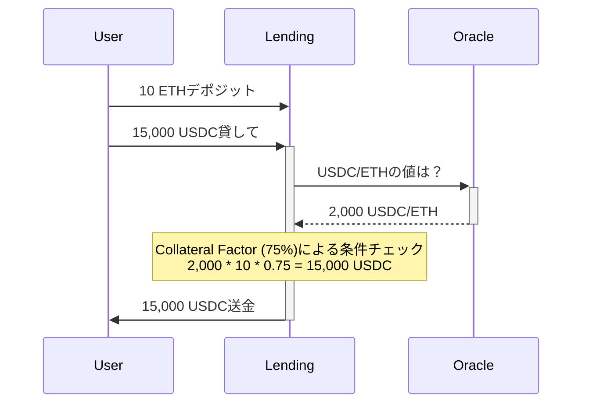
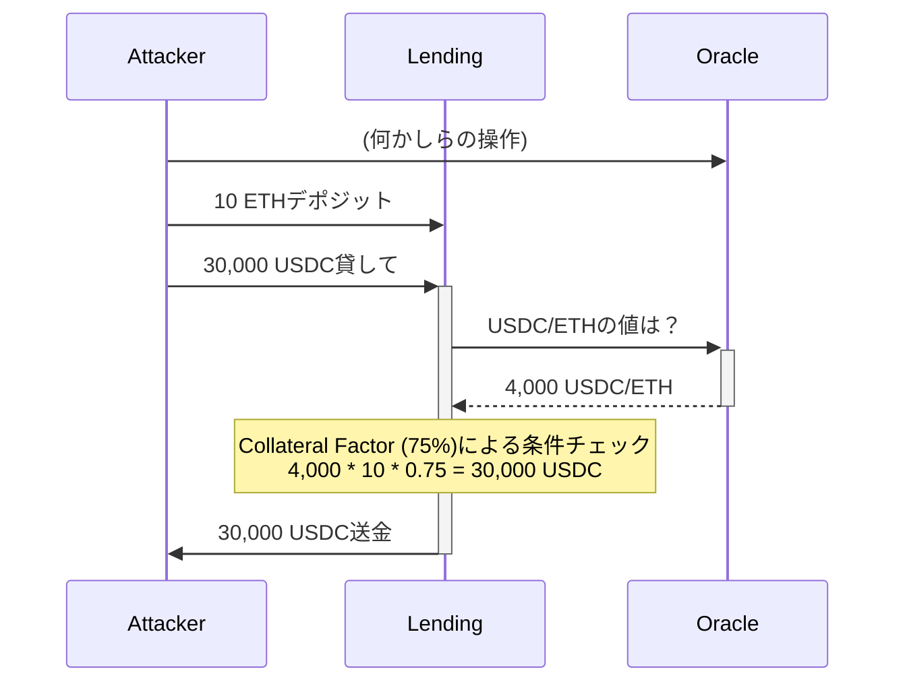
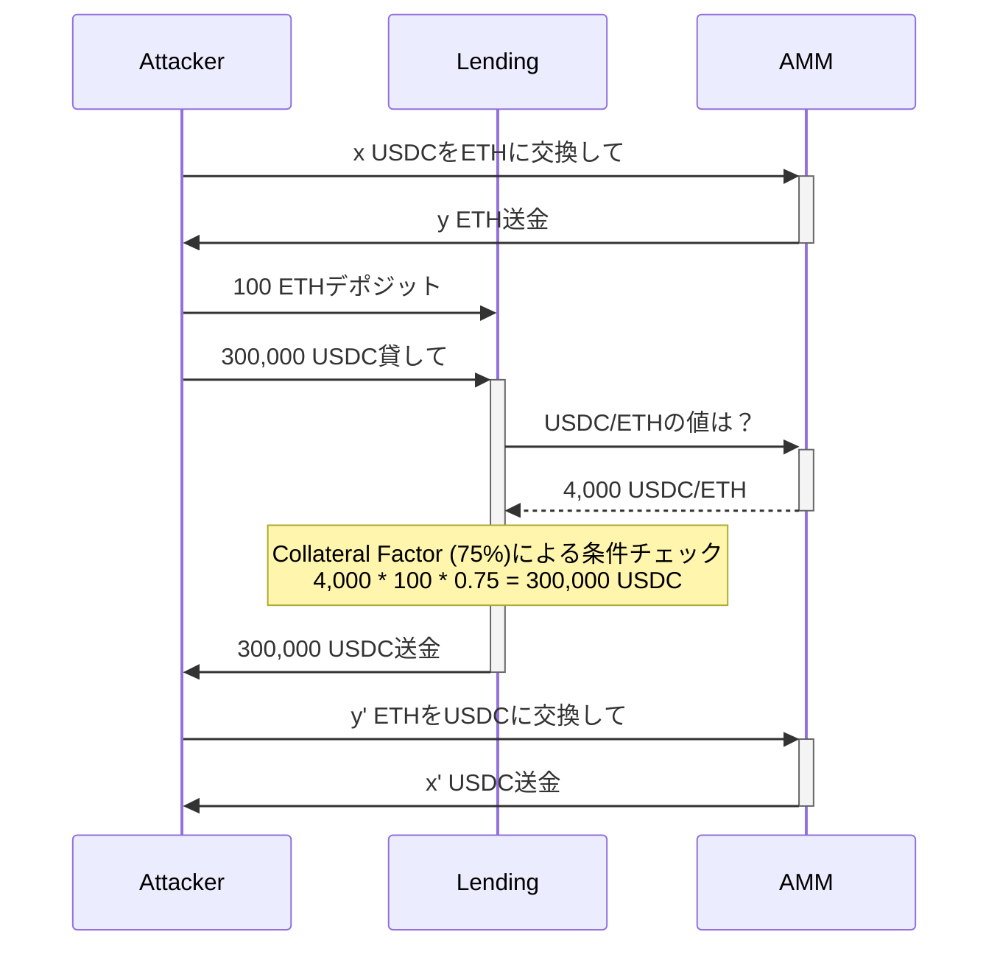
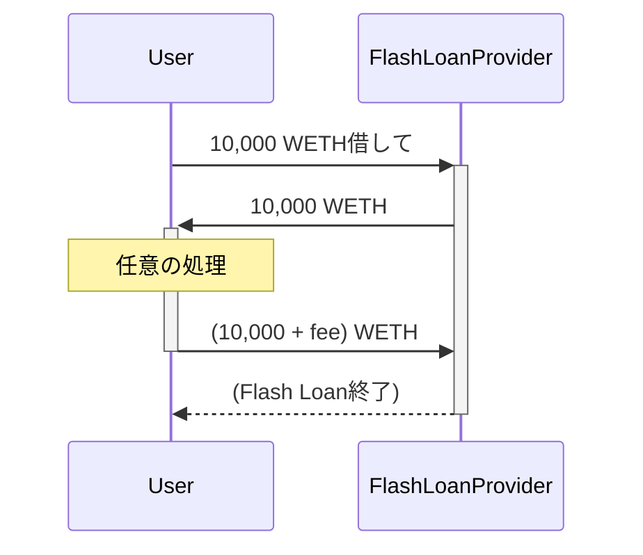
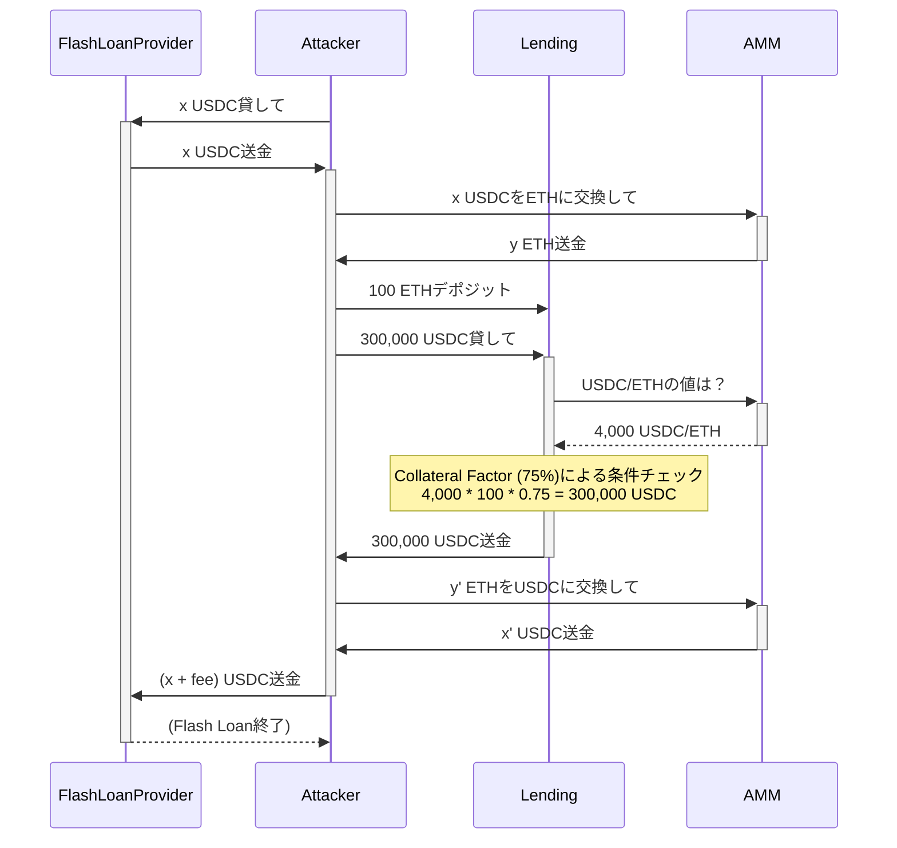

# Oracle Manipulation Attacks & Flash Loans

**目次**
- [オラクルとは](#オラクルとは)
- [Oracle Manipulation Attackとは](#oracle-manipulation-attackとは)
- [Oracle Manipulation Attackの具体例](#oracle-manipulation-attackの具体例)
	- [演習](#演習)
- [Oracle Manipulation Attackの対策](#oracle-manipulation-attackの対策)
	- [Time Weighted Average Pricing (TWAP)](#time-weighted-average-pricing-twap)
	- [非中央集権型オラクル](#非中央集権型オラクル)
- [Flash Loanとは](#flash-loanとは)
	- [演習](#演習-1)
- [Flash Loanを利用したOracle Manipulation Attack](#flash-loanを利用したoracle-manipulation-attack)
	- [演習](#演習-2)

## オラクルとは

Oracle Manipulation Attackの説明をする前に、簡単にオラクル（oracle）について説明します。

ブロックチェーンにおけるオラクルとは、狭義には、オンチェーン（= チェーン内）のスマートコントラクトに、オフチェーン（= チェーン外）の情報を提供するプロトコルのことです。
広義には、オンチェーンだけで収集できる情報を加工して提供する関数やコントラクトもオラクルと呼びます。

ブロックチェーンの仕組み上、コントラクトはブロックチェーンの外で起こっている情報を得るために、オフチェーンの主体に依存する必要があります。
例えば、現実世界の天気や株式の価格などは、ブロックチェーン上に存在しないため、誰かが提供する必要があります。
これをオラクル問題と呼びます。

オラクル問題を非中央集権的に解決するために、オフチェーンの情報をオンチェーンに非中央集権的にコミットするプロトコルがあり、非中央集権型オラクル（Decentralized Oracle）と呼ばれます。
代表的な非中央集権型オラクルのプロトコルに[Chainlink](https://chain.link/)があります。
非中央集権型オラクルについては、後で詳しく説明します。

## Oracle Manipulation Attackとは

Oracle Manipulation Attackとは、オラクルを故意に操作することでオラクルを利用するプロトコルからトークンの奪取などを行う攻撃の総称です。
特に、オラクルの広義の意味に含まれる「オンチェーンだけで収集できる情報を加工して提供する関数やコントラクト」は適切な利用を行わないと、この種の攻撃に脆弱になりやすいです。

##  Oracle Manipulation Attackの具体例

Oracle Manipulation Attackの単純な例を説明します。

まず、ユーザー、レンディングプロトコル、オラクルの3つのパーティーがいるとしましょう。
ユーザーは、レンディングプロトコルにいくらかのETHをデポジットすれば、ある閾値までのUSDCを借りることができます。
レンディングプロトコルは、USDC/ETHの価格を提供するオラクルを利用して、その閾値を決定します。
オラクルは具体的には、UniswapなどのAMMを想定してもらって構いません。

悪意のない一般ユーザーがレンディングプロトコルから資産を借りる流れは以下の図のようになります。
（通常の矢印がアクションで、点線の矢印が単なる返り値を表しています。）



さて、ここでオラクルを操作することで何か攻撃を行うことはできないでしょうか？

もしオラクルが提供する価格を操作できるとしましょう。
そうすると、本来借りれるはずの額よりも大きな額のUSDCを借りれてしまいます。
例えば、USDC/ETHの価格が現在の倍の4,000 USDC/ETHに出来たら、30,000 USDC借りることが出来ます。
攻撃者はそのUSDCを返さなければ、結果として、30,000 USDC - 2,000 USDC/ETH * 10 ETH = 10,000 USDC を利益にできてしまいます。

図に表すと以下の流れになります。



それでは、オラクルへの具体的な操作は何が考えられるでしょうか？

オラクルの実態は取引所なので、ETHを大量に買い上げればUSDC/ETHの値が上がるでしょう。

その取引所の価格決定アルゴリズムが $xy = k$ 型で、USDC-ETHプールにあるUSDCとETHの総量がそれぞれ、20,000,000 USDCと10,000 ETHだとします。
もし2,000 USDC/ETHから4,000 USDC/ETHになったときのETHの量を $x$ とすれば、 $4000 x^2 = 20000000 \times 10000$ を満たします。
$x$ を求めると $7071$ 程度になります。
一方でUSDCの量は、 $4000x = 28284000$ 程度です。
つまり、8,284,000 USDCを所持していれば価格を4,000 USDC/ETHに釣り上げることが可能です。

USDC-ETHプールの交換手数料を0.3 %とすると、ざっくりと8,284,000 USDC * 0.3 % * 2回 = 49,704 USDCの手数料がかかります。
攻撃者の利益はレンディングプロトコルが持つUSDCの総量の1/3であるため、その総量が約49,704 * 3 = 149,112 USDC以上であれば、攻撃者は利益を得られることになります。

最終的に残ったETHをUSDCに戻せば攻撃完了です。

この攻撃の流れを図に表すと次のようになります。
8,284,000や7,071のような数値は $x,y$ などの記号にしています。




この攻撃では、一つ攻撃者にとって問題点があります。
それは、攻撃者が8,284,000 USDCを用意しなくてはならない点です。
しかし、後述するFlash Loanと組み合わせることで、攻撃者は無一文でも攻撃を行うことができます（厳密にはトランザクション手数料分のETHを保持している必要があります）。

### 演習

問題ディレクトリ: [challenge-oracle-manipulation](challenge-oracle-manipulation)

プレイヤーは`A`トークンを初期状態で9,000,000持っています。
`Challenge.sol`の`LendingPool`コントラクトに対してOracle Manipulation Attackを行い、`A`トークンを全て排出して、プレイヤーのトークン`A`の総量を9,100,000以上にしてください。

以下のコマンドを実行して、テストがパスしたら成功です。

```
forge test -vvv --match-path course/oracle-manipulation/challenge-oracle-manipulation/Challenge.t.sol
```

## Oracle Manipulation Attackの対策

Oracle Manipulation Attackの対策として、「Time Weighted Average Pricing (TWAP)」と「非中央集権型オラクル」の2つの技術を紹介します。

### Time Weighted Average Pricing (TWAP)

TWAPは、複数のブロックの価格の平均を取ることで価格を決定するアルゴリズムです。
TWAPはUniswapなどのプロトコルで提供されています。

例えば、ある時点 $i$ での価格を $P_i$ とすると、 $[a,a+1,\ldots,b-1]$ のTWAPは次のように表せます。

$$\mathrm{TWAP} = \frac{P_{a}+P_{a+1}+\cdots + P_{b-1}}{b-a}$$

このTWAPを導入することで、先程紹介したようなOracle Manipulation Attackを防ぐことができます。

まず、TWAPを導入すれば、現在のトランザクション（あるいはブロック）の時点での価格だけ操作しても、価格を適正価格から大きく乖離できずに攻撃が失敗します。
具体的には、ある時点での価格操作の影響が $\frac{1}{b-a}$ になってしまいます。

次に、そもそも現在のブロックの価格がTWAPの計算に含まれないようなTWAPの場合は、そもそも価格への影響はありません。

さらに、攻撃を2つ以上のトランザクションに分けてTWAPを操作しようとしても、すぐに他のユーザーによるアービトラージが行われ、適正価格に修正されてしまいます。
適正価格に修正されると、何度も不利な価格でスワップすることになります。
結局、そのような攻撃は非常に高いコストがかかるため、攻撃しても損するだけでインセンティブがありません。

特に、Oracle Manipulation Attackは後述するFlash Loanと組み合わせられることがほとんどであり、Flash Loanを利用すると1トランザクションで攻撃を完結させないといけないため、TWAPは強力な対策の一つです。

また、TWAPは価格決定アルゴリズムの中では非常にシンプルであるため、オンチェーンで実装する上で相性が良いというメリットもあります。

ただし、急激な価格変化にすぐに追いつけないという性質はあります。

### 非中央集権型オラクル

Chainlinkなどは、複数のある程度信頼できるパーティーからの価格データを収集し、そのデータをオンチェーンにコミットするプロトコルを非中央集権的に運用しています。
この非中央集権型オラクルを利用することでも、先程紹介したようなOracle Manipulation Attackを防ぐことがきます。

Chainlinkのノードがオンチェーンに価格データをコミットしなくてはならないため、チェーンが混雑しているときは、価格更新トランザクションがすぐに実行されない可能性があります。

## Flash Loanとは

Flash Loanとは、トランザクションの終了までに借りた資産が返却される限り、無担保で資産を借入できるローンのことです。
借り手は、そのトランザクション内で借りた資産をどのように扱っても良いです。
手数料は発生しますが、借りた期間に基づく利子はありません。

Flash LoanはUniswapを始めとする様々な取引所で提供されています。

例えば、10,000 WETHを借りるFlash Loanは次のようなイメージです。



### 演習

問題ディレクトリ: [challenge-flash-loan](challenge-flash-loan)

Uniswap V2のフラッシュローン（Flash Swapと呼びます）を使って、`Flag`コントラクトの`solved`フラグを立ててください。
Flash Swapの使い方は、[Uniswapのドキュメント](https://docs.uniswap.org/contracts/v2/guides/smart-contract-integration/using-flash-swaps)を参照してください。

今までの演習問題と異なり、メインチェーンをフォークしていることに注意してください。

Flash Loanを行う際に使えるアドレスを参考までに載せておきます（これらアドレスを使わなくても構いません）。
- WETHのアドレス: `0xC02aaA39b223FE8D0A0e5C4F27eAD9083C756Cc2`
- USDC-WETH Pairのアドレス: `0xB4e16d0168e52d35CaCD2c6185b44281Ec28C9Dc`

以下のコマンドを実行して、テストがパスしたら成功です。

```
forge test -vvv --match-path course/oracle-manipulation/challenge-flash-loan/Challenge.t.sol
```

## Flash Loanを利用したOracle Manipulation Attack

最初の紹介したOracle Manipulation Attackでは、攻撃者が初期状態で大量のUSDCを持っている必要がありました。
しかし、今紹介したFlash Loanを利用することで、攻撃に必要な資産を準備する必要はもうありません。

Flash Loanと組み合わせたときのOracle Manipulation Attackは次のようなイメージになります。




### 演習

問題ディレクトリ: [challenge-oracle-manipulation-with-flash-loan](challenge-oracle-manipulation-with-flash-loan)

最初の演習と異なり、プレイヤーは`A`トークンを初期状態で所持していません。
今回の問題でもメインネットをフォークしています。
それに加えて、`A`トークンに`USDC`が、`B`トークンに`WETH`が割り当てられています。

`Challenge.sol`の`LendingPool`コントラクトに対して、Flash Loanを用いたOracle Manipulation Attackを行い`USDC`を全て排出して、プレイヤーの`USDC`の総量を100,000以上にしてください。

以下のコマンドを実行して、テストがパスしたら成功です。

```
forge test -vvv --match-path course/oracle-manipulation/challenge-oracle-manipulation-with-flash-loan/Challenge.t.sol
```
