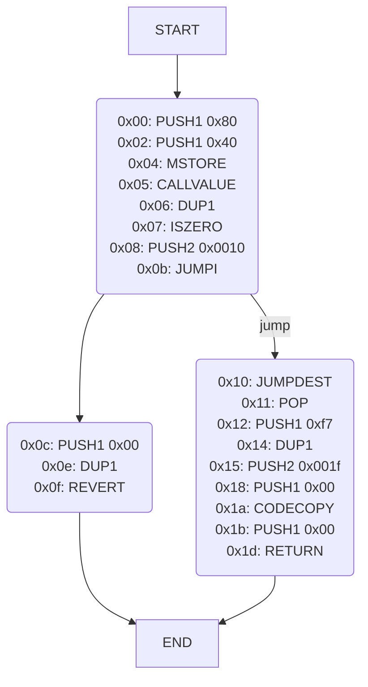
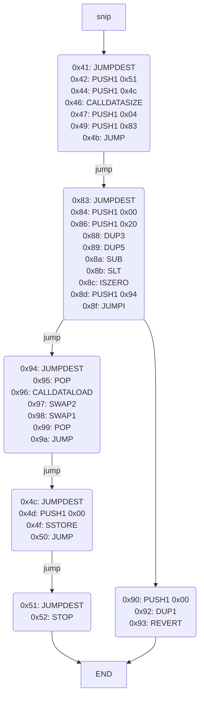
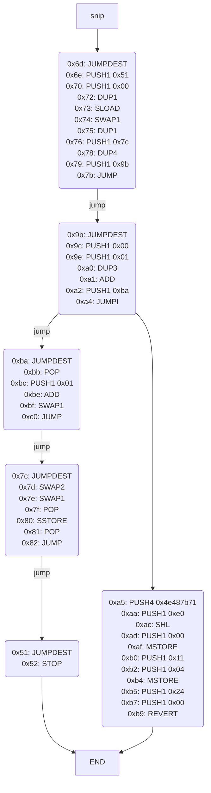

# Reversing EVM Bytecodes

このページでは、EVMバイトコードのリバーシングについて解説します。
先に「[EVM Assembly Programming with Huff](../evm-with-huff)」を読んでおくことをおすすめします。

**目次**
- [EVMバイトコードの逆アセンブル](#evmバイトコードの逆アセンブル)
- [デプロイ処理の逆アセンブル結果を読む](#デプロイ処理の逆アセンブル結果を読む)
	- [`0x00: PUSH1 0x80`](#0x00-push1-0x80)
	- [`0x02: PUSH1 0x40`](#0x02-push1-0x40)
	- [`0x04: MSTORE`](#0x04-mstore)
	- [`0x05: CALLVALUE`](#0x05-callvalue)
	- [`0x06: DUP1`](#0x06-dup1)
	- [`0x07: ISZERO`](#0x07-iszero)
	- [`0x08: PUSH2 0x0010`](#0x08-push2-0x0010)
	- [`0x0b: JUMPI`](#0x0b-jumpi)
	- [`0x10: JUMPDEST`](#0x10-jumpdest)
	- [`0x11: POP`](#0x11-pop)
	- [`0x12: PUSH1 0xf7` - `0x18: PUSH1 0x00`](#0x12-push1-0xf7---0x18-push1-0x00)
	- [`0x1a: CODECOPY`](#0x1a-codecopy)
	- [`0x1b: PUSH1 0x00`](#0x1b-push1-0x00)
	- [`0x1d: RETURN`](#0x1d-return)
	- [補足: `callvalue`の条件分岐](#補足-callvalueの条件分岐)
- [`Counter`コントラクトの逆アセンブル結果を読む](#counterコントラクトの逆アセンブル結果を読む)
	- [EVMの逆アセンブル結果を素早く読むテクニック](#evmの逆アセンブル結果を素早く読むテクニック)
	- [`0x00` - `0x0a`: `non-payable`チェック](#0x00---0x0a-non-payableチェック)
	- [`0x0b` - `0x0e`: Etherを送金してしまった場合](#0x0b---0x0e-etherを送金してしまった場合)
	- [`0x0f` - `0x17`: コールデータのサイズチェック](#0x0f---0x17-コールデータのサイズチェック)
	- [`0x3c` - `0x40`: 関数呼び出しでない場合リバート](#0x3c---0x40-関数呼び出しでない場合リバート)
	- [`0x18` - `0x27`: 関数の特定（`setNumber(uint256)`）](#0x18---0x27-関数の特定setnumberuint256)
	- [`0x28` - `0x31`: 関数の特定（`number()`）](#0x28---0x31-関数の特定number)
	- [`0x32` - `0x3b`: 関数の特定（`increment()`）](#0x32---0x3b-関数の特定increment)
	- [`0x41` - `0x50`, `0x83` - `0x9a`: `setNumber(uint256)`](#0x41---0x50-0x83---0x9a-setnumberuint256)
	- [`0x53` - `0x6c`: `number()`](#0x53---0x6c-number)
	- [`0x6d` - `0x82`, `0x9b` - `0xc0`: `increment()`](#0x6d---0x82-0x9b---0xc0-increment)


## EVMバイトコードの逆アセンブル

さきほどの`bytecode`を`RETURN`オペコードまで逆アセンブルすると次のようになります。

```
0x00: (0x60) PUSH1 0x80
0x02: (0x60) PUSH1 0x40
0x04: (0x52) MSTORE
0x05: (0x34) CALLVALUE
0x06: (0x80) DUP1
0x07: (0x15) ISZERO
0x08: (0x61) PUSH2 0x0010
0x0b: (0x57) JUMPI
0x0c: (0x60) PUSH1 0x00
0x0e: (0x80) DUP1
0x0f: (0xfd) REVERT
0x10: (0x5b) JUMPDEST
0x11: (0x50) POP
0x12: (0x60) PUSH1 0xf7
0x14: (0x80) DUP1
0x15: (0x61) PUSH2 0x001f
0x18: (0x60) PUSH1 0x00
0x1a: (0x39) CODECOPY
0x1b: (0x60) PUSH1 0x00
0x1d: (0xf3) RETURN
```

これは、[erever](https://github.com/minaminao/erever)という自作ツールで出力したもので、左からアドレス、オペコード、ニーモニック（、ハードコードされた`PUSH`命令の引数）です。

ただし、これはおすすめのツールではなく、おすすめは[evm.codesのPlayground](https://www.evm.codes/playground)です。
（このPlaygroundだとアドレスと元のバイトコードを一緒に出力できないので使わなかっただけです。）
evm.codesはEVMの仕様や各オペコードの説明が載っているだけでなく、上記のPlaygroundページでバイトコードのステップ実行もできるサイトです。
このPlaygroundページで、`bytecode`を入力して`Run`ボタンを押せば逆アセンブルが行われます。
慣れてきたら、[Bytegraph](https://bytegraph.xyz/)というツールもグラフ表示できておすすめです。

ここでは、`RETURN`命令以降を逆アセンブルしませんでした。
なぜなら、`bytecode`の構成が`(デプロイ処理のバイトコード) + deployedBytecode`という構成になっており、デプロイ処理のバイトコードが`RETURN`命令までの`0x608060405234801561001057600080fd5b5060f78061001f6000396000f3fe`であるからです。
`RETURN`命令以降は`Counter`コントラクトのバイトコードになっており、先程の`deployedBytecode`です。

## デプロイ処理の逆アセンブル結果を読む

まずは、デプロイ処理部分の逆アセンブル結果を順に読んで、具体的にどういった処理を行っているかを見ていきましょう。

### `0x00: PUSH1 0x80`

EVMでは、全てのオペコードは1バイトです。
そのため、バイトコードが1バイトずつ読み込まれて実行されます。

`bytecode`の最初の1バイトを読むと、`0x60`です。
`0x60`は`PUSH1`命令を表します。
`PUSH1`は、スタックと呼ばれるデータ領域に1バイトのデータをプッシュする命令です。
先程、全てのオペコードが1バイトであると述べましたが、`PUSHx`（`x`は数値が入る）命令のみ、オペコードの後にプッシュする値が`x`バイト続きます。

スタックとは、EVMにおけるデータを保存する領域のうちの1つです。
データ領域として重要なものが3つあり、「ストレージ」「メモリ」「スタック」です。

スタックは、一般的なスタック構造と同様に、プッシュ（`PUSHx`命令）とポップ（`POP`命令）の2つの操作ができ、後にプッシュしたものが先にポップされるデータ構造です。
プッシュとポップ以外にも、スタックの要素の複製を行う`DUPx`命令や、スタックの要素をスワップさせる`SWAPx`命令などの操作もサポートされています。

スタックは、コールごとに作られコールが終わると破棄されます。
スタックに保管できる要素の制限は1024であり、その数を超えてプッシュしようとするとStack Too Deepと呼ばれるエラーが起き、トランザクションがリバートします。

`PUSH1`に続く1バイトを見てみると、`0x80`となっているので、この命令が実行されると`0x80`がスタックにプッシュされます。
プッシュされた後のスタックの状況を`[0x80]`と表すとします。
ただし、新しく追加したデータは左から追加することにします（例えば、`0x00`がプッシュされたら`[0x00, 0x80]`と表す）。

### `0x02: PUSH1 0x40`

`0x6080`（`PUSH1 0x80`）に続くデータは`0x6040`です。
これは、`PUSH1 0x40`なので同様に処理され、スタックは`[0x40, 0x80]`となります。

### `0x04: MSTORE`

続いて`0x52`である`MSTORE`が実行されます。
`MSTORE`は、`offset`と`value`の2つの引数をスタックから順にポップして受け取り、メモリの`[offset,offset+32)`の位置に`value`をストアする命令です。

メモリとは、先程紹介したデータを保存する3つの領域のうちの1つです。
メモリは連続的なデータ領域です。
スタックと同様に、コールごとに作られコールが終わると破棄されます。
`MLOAD`命令で任意の位置のメモリの値をロードできます。

現在のスタックが`[0x40, 0x80]`なので、`0x40`の位置に`0x80`が32バイトの値としてストアされ、メモリは次のようになります。

```
0x00: 0000000000000000000000000000000000000000000000000000000000000000
0x20: 0000000000000000000000000000000000000000000000000000000000000000
0x40: 0000000000000000000000000000000000000000000000000000000000000080
```

### `0x05: CALLVALUE`

次に`CALLVALUE`命令が実行されます。
`CALLVALUE`命令は、送信されたEtherの額をスタックにプッシュします。
Solidityにおける`msg.value`と似たようなものです。

`callvalue`を適当な定数すると、スタックは`[callvalue]`となります。

### `0x06: DUP1`

次に`DUP1`命令が実行されます。
`DUP1`命令は、スタックのトップを複製します。

これで、スタックは`[callvalue, callvalue]`となります。

### `0x07: ISZERO`

次に`ISZERO`命令が実行されます。
`ISZERO`命令は、スタックから1つ値をポップして受け取り、その値が`0`であれば`1`をスタックにプッシュし、そうでなければ`0`をスタックにプッシュする命令です。

現在のスタックのトップは`callvalue`であり、`0`か`0`以外であるかは不明です。
しかし、このトランザクションで作成する`Counter`コントラクトは`non-payable`なコンストラクタを持ちます。
そのため`callvalue`を`0`としましょう。

そうすれば、スタックは`[0x01, 0x00]`となります。

### `0x08: PUSH2 0x0010`

次に`PUSH2`命令が実行されます。
先程の`PUSH1`異なり`PUSH2`なので後続の2バイトである`0x0010`がプッシュされます。

スタックは`[0x0010, 0x01, 0x00]`となります。

### `0x0b: JUMPI`

次に`JUMPI`命令が実行されます。
`JUMPI`命令は、条件分岐を行います。
`pc`と`cond`の2つの引数をスタックから順にポップして、条件である`cond`が`0`でなければ、プログラムカウンタを`pc`に飛ばします。
プログラムカウンタとは、次に実行するコードのアドレスのことです。
ただし、`pc`のアドレスの命令は必ず`JUMPDEST`でなければなりません。
それ以外のアドレスを`pc`にした場合、トランザクションはリバートします。

現在のスタックから、`cond`が`0x01`なので、プログラムカウンタは`0x10`に飛びます。
`0x10`は`JUMPDEST`ですので、正常に実行されます。

条件分岐を可視化すると、`bytecode`は次のようなフローになります。



（ereverのMermaidフローチャート作成機能を使用）

スタックは`[0x00]`になります。

### `0x10: JUMPDEST`

先程説明したように、ジャンプした先は`JUMPDEST`命令でなければなりません。
この命令は何も状態を変化させません。

### `0x11: POP`

`POP`命令はスタックから1つ要素をポップする命令です。
今は一つしか要素がないので、これによりスタックは空になります。

### `0x12: PUSH1 0xf7` - `0x18: PUSH1 0x00`

`0x12`から`0x18`までの処理は、今まで説明してきた命令のみ使っており、次のように状態が変化します。
- `0x12: PUSH1 0xf7`により、スタックが`[0xf7]`になります。
- `0x14: DUP1`により、スタックが`[0xf7, 0xf7]`になります。
- `0x15: PUSH2 0x001f`により、スタックが`[0x1f, 0xf7, 0xf7]`になります。
- `0x18: PUSH1 0x00`により、スタックが`[0x00, 0x1f, 0xf7, 0xf7]`になります。

### `0x1a: CODECOPY`

`CODECOPY`命令は、`destOffset`,`offset`,`size`の3つの引数をスタックからポップして取得し、現在実行しているコードを`[offset,offset+size)`の部分を、メモリの`destOffset`へコピーする命令です。

今回は`[0x1f,0x1f+0xf7]`である`0x6080604052348015600f57600080fd5b5060043610603c5760003560e01c80633fb5c1cb1460415780638381f58a146053578063d09de08a14606d575b600080fd5b6051604c3660046083565b600055565b005b605b60005481565b60405190815260200160405180910390f35b6051600080549080607c83609b565b9190505550565b600060208284031215609457600080fd5b5035919050565b60006001820160ba57634e487b7160e01b600052601160045260246000fd5b506001019056fea2646970667358221220fae0b1cefc14f831678071dac56d7c756dba4a7e705742be3f473c8c85e2769564736f6c63430008140033`を、メモリに格納しています。
これは、`deployedCode`と同じです。

スタックは`[0xf7]`になります。

### `0x1b: PUSH1 0x00`

スタックが`[0x00, 0xf7]`になります。

### `0x1d: RETURN`

`RETURN`命令は、`offset`と`size`の2つの引数をスタックからポップして取得し、メモリの`[offset,offset+size]`をリターンする命令です。

コントラクト作成トランザクションでは、最終的にこのリターンデータがコントラクトのバイトコードとなります。

今回のケースでは、`Counter`コントラクトのバイトコードをリターンしたいので、先程`CODECOPY`でメモリに格納したバイト列をリターンしたということです。

### 補足: `callvalue`の条件分岐

`callvalue`の条件分岐はコンストラクタに`payable`が指定されている場合消えます。
つまり、デプロイ処理部分のバイトコードが次のようになり、`JUMPI`命令が無くなります。

```
0x00: PUSH1 0x80
0x02: PUSH1 0x40
0x04: MSTORE
0x05: PUSH1 0xf7
0x07: DUP1
0x08: PUSH2 0x0012
0x0b: PUSH1 0x00
0x0d: CODECOPY
0x0e: PUSH1 0x00
0x10: RETURN
```

コンストラクタが`non-payble`である場合、ユーザーがデプロイ時に間違えてEtherを送金した場合に、トランザクションが失敗するように保護しているということです。


## `Counter`コントラクトの逆アセンブル結果を読む

次は、`Counter`コントラクト本体の逆アセンブル結果を読んでみましょう。
`deployedBytecode`をメタデータ部分（後述）より前まで逆アセンブルすると次のようになります。
長いです。

```
0x00: (0x60) PUSH1 0x80
0x02: (0x60) PUSH1 0x40
0x04: (0x52) MSTORE
0x05: (0x34) CALLVALUE
0x06: (0x80) DUP1
0x07: (0x15) ISZERO
0x08: (0x60) PUSH1 0x0f
0x0a: (0x57) JUMPI
0x0b: (0x60) PUSH1 0x00
0x0d: (0x80) DUP1
0x0e: (0xfd) REVERT
0x0f: (0x5b) JUMPDEST
0x10: (0x50) POP
0x11: (0x60) PUSH1 0x04
0x13: (0x36) CALLDATASIZE
0x14: (0x10) LT
0x15: (0x60) PUSH1 0x3c
0x17: (0x57) JUMPI
0x18: (0x60) PUSH1 0x00
0x1a: (0x35) CALLDATALOAD
0x1b: (0x60) PUSH1 0xe0
0x1d: (0x1c) SHR
0x1e: (0x80) DUP1
0x1f: (0x63) PUSH4 0x3fb5c1cb
0x24: (0x14) EQ
0x25: (0x60) PUSH1 0x41
0x27: (0x57) JUMPI
0x28: (0x80) DUP1
0x29: (0x63) PUSH4 0x8381f58a
0x2e: (0x14) EQ
0x2f: (0x60) PUSH1 0x53
0x31: (0x57) JUMPI
0x32: (0x80) DUP1
0x33: (0x63) PUSH4 0xd09de08a
0x38: (0x14) EQ
0x39: (0x60) PUSH1 0x6d
0x3b: (0x57) JUMPI
0x3c: (0x5b) JUMPDEST
0x3d: (0x60) PUSH1 0x00
0x3f: (0x80) DUP1
0x40: (0xfd) REVERT
0x41: (0x5b) JUMPDEST
0x42: (0x60) PUSH1 0x51
0x44: (0x60) PUSH1 0x4c
0x46: (0x36) CALLDATASIZE
0x47: (0x60) PUSH1 0x04
0x49: (0x60) PUSH1 0x83
0x4b: (0x56) JUMP
0x4c: (0x5b) JUMPDEST
0x4d: (0x60) PUSH1 0x00
0x4f: (0x55) SSTORE
0x50: (0x56) JUMP
0x51: (0x5b) JUMPDEST
0x52: (0x00) STOP
0x53: (0x5b) JUMPDEST
0x54: (0x60) PUSH1 0x5b
0x56: (0x60) PUSH1 0x00
0x58: (0x54) SLOAD
0x59: (0x81) DUP2
0x5a: (0x56) JUMP
0x5b: (0x5b) JUMPDEST
0x5c: (0x60) PUSH1 0x40
0x5e: (0x51) MLOAD
0x5f: (0x90) SWAP1
0x60: (0x81) DUP2
0x61: (0x52) MSTORE
0x62: (0x60) PUSH1 0x20
0x64: (0x01) ADD
0x65: (0x60) PUSH1 0x40
0x67: (0x51) MLOAD
0x68: (0x80) DUP1
0x69: (0x91) SWAP2
0x6a: (0x03) SUB
0x6b: (0x90) SWAP1
0x6c: (0xf3) RETURN
0x6d: (0x5b) JUMPDEST
0x6e: (0x60) PUSH1 0x51
0x70: (0x60) PUSH1 0x00
0x72: (0x80) DUP1
0x73: (0x54) SLOAD
0x74: (0x90) SWAP1
0x75: (0x80) DUP1
0x76: (0x60) PUSH1 0x7c
0x78: (0x83) DUP4
0x79: (0x60) PUSH1 0x9b
0x7b: (0x56) JUMP
0x7c: (0x5b) JUMPDEST
0x7d: (0x91) SWAP2
0x7e: (0x90) SWAP1
0x7f: (0x50) POP
0x80: (0x55) SSTORE
0x81: (0x50) POP
0x82: (0x56) JUMP
0x83: (0x5b) JUMPDEST
0x84: (0x60) PUSH1 0x00
0x86: (0x60) PUSH1 0x20
0x88: (0x82) DUP3
0x89: (0x84) DUP5
0x8a: (0x03) SUB
0x8b: (0x12) SLT
0x8c: (0x15) ISZERO
0x8d: (0x60) PUSH1 0x94
0x8f: (0x57) JUMPI
0x90: (0x60) PUSH1 0x00
0x92: (0x80) DUP1
0x93: (0xfd) REVERT
0x94: (0x5b) JUMPDEST
0x95: (0x50) POP
0x96: (0x35) CALLDATALOAD
0x97: (0x91) SWAP2
0x98: (0x90) SWAP1
0x99: (0x50) POP
0x9a: (0x56) JUMP
0x9b: (0x5b) JUMPDEST
0x9c: (0x60) PUSH1 0x00
0x9e: (0x60) PUSH1 0x01
0xa0: (0x82) DUP3
0xa1: (0x01) ADD
0xa2: (0x60) PUSH1 0xba
0xa4: (0x57) JUMPI
0xa5: (0x63) PUSH4 0x4e487b71
0xaa: (0x60) PUSH1 0xe0
0xac: (0x1b) SHL
0xad: (0x60) PUSH1 0x00
0xaf: (0x52) MSTORE
0xb0: (0x60) PUSH1 0x11
0xb2: (0x60) PUSH1 0x04
0xb4: (0x52) MSTORE
0xb5: (0x60) PUSH1 0x24
0xb7: (0x60) PUSH1 0x00
0xb9: (0xfd) REVERT
0xba: (0x5b) JUMPDEST
0xbb: (0x50) POP
0xbc: (0x60) PUSH1 0x01
0xbe: (0x01) ADD
0xbf: (0x90) SWAP1
0xc0: (0x56) JUMP
0xc1: (0xfe) INVALID
```

そして、この`INVALID`に続いて以下のメタデータのハッシュを含むデータ`a2646970667358221220fae0b1cefc14f831678071dac56d7c756dba4a7e705742be3f473c8c85e2769564736f6c63430008140033`が続きます。
このデータについては、Solidityドキュメントの「[バイトコードにおけるメタデータハッシュのエンコーディング](https://solidity-ja.readthedocs.io/ja/latest/metadata.html#encoding-of-the-metadata-hash-in-the-bytecode)」に詳しく書いてあるので、ここでは省略します。

### EVMの逆アセンブル結果を素早く読むテクニック

上記の逆アセンブル結果を一行一行追うのは流石に大変です。

今回のようにコンパイル前のSolidityコードがある場合はまだ良いですが、Solidityコードが無い場合に以下のテクニックが有用であることが経験則でわかっています。
- `JUMPI`の条件式やリターンデータが本質なので、そこだけ読む
	- `JUMPI`までの処理は、条件式の構築処理が占める
	- 同じく`RETURN`命令までの処理は、リターンデータの構築処理が占める
- 準じて、条件式やリターンデータの構築とは関係なさそうな命令に注目する
	- ストレージの操作やコントラクトコールなど
	- 逆に、スタックの単純な操作命令（`PUSHx`, `POP`, `DUPx`, `SWAPx`）や演算子系命令（`ADD`, `LT`, `AND`, `SHL`など）などの中間結果は追っても得られるものが少ない
- 各関数のスタート地点を見つけて、関数ごとのControl Flow Graph (CFG)を読む
	- 全体のControl Flow Graphを読むと複雑なので、関数のスタート地点から関数単位で読むとシンプルになる
- そのアドレスに到達するための全ての条件を確認する
	- ereverやBytegraphは自動で全ての条件を列挙する

以上を踏まえて、逆アセンブル結果を見ていきます。

### `0x00` - `0x0a`: `non-payable`チェック

`0x00`から`0x0a`までのバイトコードを、先程の逆アセンブル結果に加えて、引数の中身も表示させると次のようになります（ereverを使っています）。
これにより、`JUMPI`命令の条件式のチェックが瞬時にできるようになります。

```
0x00: PUSH1(0x80)
0x02: PUSH1(0x40)
0x04: MSTORE(0x40, 0x80)
0x05: CALLVALUE()
0x06: DUP1() # CALLVALUE()
0x07: ISZERO(CALLVALUE())
0x08: PUSH1(0x0f)
0x0a: JUMPI(0x0f, ISZERO(CALLVALUE()))
```

`JUMPI`命令の条件式を見てください。
Ether送金かあるかないかで条件分岐をしています。
これは、デプロイ処理部分でも似たような処理がありました。
Etherを送金していないと、`ISZERO`命令の結果が`1`になり、`JUMPI`命令で`0x0f`に飛ばされます。

### `0x0b` - `0x0e`: Etherを送金してしまった場合

`Counter`コントラクトは一つも`payable`な関数がありません。
そのため、もしEther送金をしないと、そのまま`0x0b`に進み、次のようにリバートします。

```
0x0b: PUSH1(0x00)
0x0d: DUP1() # 0x00
0x0e: REVERT(0x00, 0x00)
```

### `0x0f` - `0x17`: コールデータのサイズチェック

一方で、Etherを送金していなければ、`0x0f`から続く次の処理が実行されます。

```
0x0f: JUMPDEST()
0x10: POP() # CALLVALUE()
0x11: PUSH1(0x04)
0x13: CALLDATASIZE()
0x14: CALLDATASIZE() < 0x04
0x15: PUSH1(0x3c)
0x17: JUMPI(0x3c, CALLDATASIZE() < 0x04)
```

`JUMPI`命令の条件式を見てください。
`<`は、`LT`命令の略記です。
コールデータのサイズが4バイト以上かどうかで条件分岐をしています。

Solidityでは関数を関数セレクタと呼ばれる4バイトのデータで識別しています。
コールデータが4バイト未満であれば、関数の呼び出しではないと判別しているということです。

ちなみに、関数セレクタは、`keccak256("関数名(引数1の型,...,引数nの型)")`の最初の4バイトです。

### `0x3c` - `0x40`: 関数呼び出しでない場合リバート

関数呼び出しではないと判別されると、この`0x3c`に飛ばされます。

`Counter`コントラクトは`fallback`関数及び`receive`関数が無いので、必ず関数呼び出しである必要があります。
そのため、コールデータ4バイト未満だと、次の処理が実行されトランザクションがリバートします。

```
0x3c: JUMPDEST()
0x3d: PUSH1(0x00)
0x3f: DUP1() # 0x00
0x40: REVERT(0x00, 0x00)
```

### `0x18` - `0x27`: 関数の特定（`setNumber(uint256)`）

一方で、関数呼び出しであれば、次のような関数の特定処理が走り始めます。

```
0x18: PUSH1(0x00)
0x1a: CALLDATALOAD(0x00)
0x1b: PUSH1(0xe0)
0x1d: CALLDATALOAD(0x00) >> 0xe0
0x1e: DUP1() # (CALLDATALOAD(0x00) >> 0xe0)
0x1f: PUSH4(0x3fb5c1cb)
0x24: 0x3fb5c1cb == (CALLDATALOAD(0x00) >> 0xe0)
0x25: PUSH1(0x41)
0x27: JUMPI(0x41, 0x3fb5c1cb == (CALLDATALOAD(0x00) >> 0xe0))
```

`JUMPI`命令の条件式を見てください。
`0x3fb5c1cb`は`setNumber(uint256)`の関数セレクタです。
これは`cast 4 0x3fb5c1cb`を実行すればわかります。

関数セレクタは、コールデータの先頭4バイトに格納されています。
そのため、`CALLDATALOAD`命令を使って`0x00`の位置から32バイトを取得し、その値を`SHR`(`>>`)命令で先頭4バイトだけの値にして、`EQ`(`==`)命令で比較しています。

### `0x28` - `0x31`: 関数の特定（`number()`）

同様に、下記は`number()`関数への呼び出しかどうかを調べています。

```
0x28: DUP1() # (CALLDATALOAD(0x00) >> 0xe0)
0x29: PUSH4(0x8381f58a)
0x2e: 0x8381f58a == (CALLDATALOAD(0x00) >> 0xe0)
0x2f: PUSH1(0x53)
0x31: JUMPI(0x53, 0x8381f58a == (CALLDATALOAD(0x00) >> 0xe0))
```

`Counter`コントラクトではパブリック変数ですが、ドキュメントにゲッター関数が生成されるという記述があった通り、バイトコード上では他の関数同様に扱われます。

### `0x32` - `0x3b`: 関数の特定（`increment()`）

同様に、下記は`increment()`関数への呼び出しかどうかを調べています。

```
0x32: DUP1() # (CALLDATALOAD(0x00) >> 0xe0)
0x33: PUSH4(0xd09de08a)
0x38: 0xd09de08a == (CALLDATALOAD(0x00) >> 0xe0)
0x39: PUSH1(0x6d)
0x3b: JUMPI(0x6d, 0xd09de08a == (CALLDATALOAD(0x00) >> 0xe0))
```

この次の処理は、先程紹介した`0x3c`のリバート処理です。
コールデータが4バイト以上でも、指定された関数セレクタが`setNumber(uint256)`, `number()`, `increment()`の3つの関数に当てはまらなければ、リバートするということです。

### `0x41` - `0x50`, `0x83` - `0x9a`: `setNumber(uint256)`

関数が特定され`setNumber(uint256)`だった場合、`0x41`から処理が開始されます。

関数の全体的なCFGは次のようになります。



一つずつ見ていきます。

まず、下記2つのブロックを見ていきましょう。

```
0x41: JUMPDEST()
0x42: PUSH1(0x51)
0x44: PUSH1(0x4c)
0x46: CALLDATASIZE()
0x47: PUSH1(0x04)
0x49: PUSH1(0x83)
0x4b: JUMP(0x83)
```

```
0x83: JUMPDEST()
0x84: PUSH1(0x00)
0x86: PUSH1(0x20)
0x88: DUP3() # ..., 0x04
0x89: DUP5() # ..., CALLDATASIZE()
0x8a: CALLDATASIZE() - 0x04
0x8b: int256(CALLDATASIZE() - 0x04) < int256(0x20)
0x8c: ISZERO(int256(CALLDATASIZE() - 0x04) < int256(0x20))
0x8d: PUSH1(0x94)
0x8f: JUMPI(0x94, ISZERO((int256(CALLDATASIZE() - 0x04) < int256(0x20))))
```

ここでも本質的な部分は、`0x8f`の`JUMPI`命令の条件式であり、`ISZERO((int256(CALLDATASIZE() - 0x04) < int256(0x20))))`です。
`int256`で囲った比較は、`SLT`命令を直感的に表記したものです。

コールデータのサイズから関数セレクタのサイズである`0x04`を引いた値が`0x20`でなければ`0x94`に飛ばされます。
これは、`setNumber(uint256)`の引数がしっかりと与えられているかをチェックしています。
もし引数が与えられていなければ、ジャンプは実行せずに`0x90`に処理が移り、リバートします。

```
0x90: PUSH1(0x00)
0x92: DUP1() # 0x00
0x93: REVERT(0x00, 0x00)
```

引数が与えられた場合は、次の`0x94`からの処理が実行されます。

```
0x94: JUMPDEST()
0x95: POP() # 0x00
0x96: CALLDATALOAD(0x04)
0x97: SWAP2() # 0x4c, ..., CALLDATALOAD(0x04)
0x98: SWAP1() # CALLDATASIZE(), 0x4c
0x99: POP() # CALLDATASIZE()
0x9a: JUMP(0x4c)
```

```
0x4c: JUMPDEST()
0x4d: PUSH1(0x00)
0x4f: SSTORE(0x00, CALLDATALOAD(0x04))
0x50: JUMP(0x51)
```

重要なのは`0x4f`の`SSTORE`命令で、ここでコールデータの`0x04`バイト目から32バイトをストレージのスロット`0`にストアしています。

最終的に`0x51`にジャンプし、`STOP`命令が実行されトランザクションが終了します。

```
0x51: JUMPDEST()
0x52: STOP()
```

### `0x53` - `0x6c`: `number()`

次の処理が走ります。

```
0x53: JUMPDEST()
0x54: PUSH1(0x5b)
0x56: PUSH1(0x00)
0x58: SLOAD(0x00)
0x59: DUP2() # ..., 0x5b
0x5a: JUMP(0x5b)
0x5b: JUMPDEST()
0x5c: PUSH1(0x40)
0x5e: MLOAD(0x40)
0x5f: SWAP1() # SLOAD(0x00), MLOAD(0x40)
0x60: DUP2() # ..., MLOAD(0x40)
0x61: MSTORE(MLOAD(0x40), SLOAD(0x00))
0x62: PUSH1(0x20)
0x64: 0x20 + MLOAD(0x40)
0x65: PUSH1(0x40)
0x67: MLOAD(0x40)
0x68: DUP1() # MLOAD(0x40)
0x69: SWAP2() # (0x20 + MLOAD(0x40)), ..., MLOAD(0x40)
0x6a: (0x20 + MLOAD(0x40)) - MLOAD(0x40)
0x6b: SWAP1() # MLOAD(0x40), ((0x20 + MLOAD(0x40)) - MLOAD(0x40))
0x6c: RETURN(MLOAD(0x40), ((0x20 + MLOAD(0x40)) - MLOAD(0x40)))
```

最後の`0x6c`で`RETURN`命令が実行され、メモリの`MLOAD(0x40)`バイト目から`0x20 + MLOAD(0x40)`目までがリターンされています。
要は、`MLOAD(0x40)`から32バイトの値です。

それはつまり、どこかで`MSTORE`を使ってメモリに値が代入されたということなので、`MSTORE`命令を探しましょう。
`0x61`で`MSTORE`を使って`MLOAD(0x40)`に`SLOAD(0x00)`の値がストアされています。
`0x61`から`0x6c`までの間にメモリの`0x40`から始まる32バイトの値が書き換わっていたら、`MLOAD(0x40)`の値も書き換わってしまいますが、メモリ操作系の命令が無いので大丈夫でしょう。

これで`RETURN`命令によって、スロット`0`である`number`変数の値がリターンされたことがわかります。

### `0x6d` - `0x82`, `0x9b` - `0xc0`: `increment()`

最後に`increment`関数です。

関数全体のCFGは次のようになります。



まず、次の2つのブロックの処理が実行されます。

```
0x6d: JUMPDEST()
0x6e: PUSH1(0x51)
0x70: PUSH1(0x00)
0x72: DUP1() # 0x00
0x73: SLOAD(0x00)
0x74: SWAP1() # 0x00, SLOAD(0x00)
0x75: DUP1() # 0x00
0x76: PUSH1(0x7c)
0x78: DUP4() # ..., SLOAD(0x00)
0x79: PUSH1(0x9b)
0x7b: JUMP(0x9b)
```

```
0x9b: JUMPDEST()
0x9c: PUSH1(0x00)
0x9e: PUSH1(0x01)
0xa0: DUP3() # ..., SLOAD(0x00)
0xa1: SLOAD(0x00) + 0x01
0xa2: PUSH1(0xba)
0xa4: JUMPI(0xba, SLOAD(0x00) + 0x01)
```

`0xa4`の`JUMPI`の条件式を見ると、`SLOAD(0x00) + 0x01`が`0`以外であるかどうかをチェックしています。
`SLOAD(0x00)`は`number`変数の値であり、`1`足して`0`になるケースは`type(uint256).max`のときのみです。
ここからオーバーフローの検知をしていると推測できます。
実際、この条件を満たさないと、次の処理が実行されトランザクションがリバートします。

```
0xa5: PUSH4(0x4e487b71)
0xaa: PUSH1(0xe0)
0xac: 0x4e487b71 << 0xe0
0xad: PUSH1(0x00)
0xaf: MSTORE(0x00, (0x4e487b71 << 0xe0))
0xb0: PUSH1(0x11)
0xb2: PUSH1(0x04)
0xb4: MSTORE(0x04, 0x11)
0xb5: PUSH1(0x24)
0xb7: PUSH1(0x00)
0xb9: REVERT(0x00, 0x24)
```

ちなみに`0x4e487b71`は`keccak256("Panic(uint256)")`の最初の4バイトです。
この第一引数にあたる値が、`0x11`であることがわかりますが、この値はオーバーフローを表しています。

オーバーフローしなかった場合、`0xba`にジャンプして、次の2つのブロックの処理を実行します。

```
0xba: JUMPDEST()
0xbb: POP() # 0x00
0xbc: PUSH1(0x01)
0xbe: 0x01 + SLOAD(0x00)
0xbf: SWAP1() # 0x7c, (0x01 + SLOAD(0x00))
0xc0: JUMP(0x7c)
```

```
0x7c: JUMPDEST()
0x7d: SWAP2() # 0x00, ..., (0x01 + SLOAD(0x00))
0x7e: SWAP1() # 0x00, 0x00
0x7f: POP() # 0x00
0x80: SSTORE(0x00, (0x01 + SLOAD(0x00)))
0x81: POP() # SLOAD(0x00)
0x82: JUMP(0x51)
```

`0x80`の`SSTORE`で、スロット`0`に`number`変数の値に`1`加算した値がストアされていることがわかります。

最終的に`setNumber(uint256)`同様に、`0x51`に飛ばされトランザクションが終了します。

```
0x51: JUMPDEST()
0x52: STOP()
```

以上で、`Counter`コントラクトのバイトコードの処理の流れが追えました。
