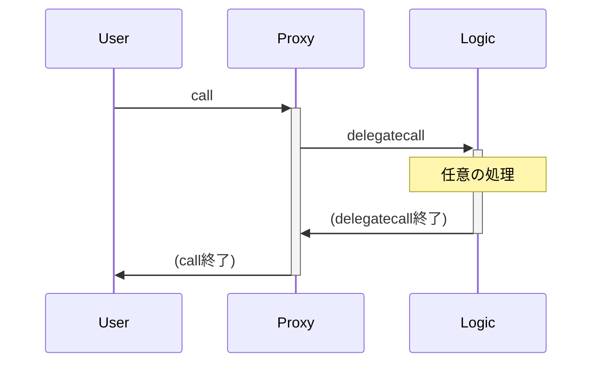

# Storage Collisions & Proxies

**目次**
- [Storage Collisionとは](#storage-collisionとは)
- [プロキシとは](#プロキシとは)
- [プロキシにおけるStorage Collision](#プロキシにおけるstorage-collision)
  - [プロキシのStorage Collisionの例](#プロキシのstorage-collisionの例)
  - [演習: コントラクトの乗っ取り](#演習-コントラクトの乗っ取り)
  - [正しい実装例](#正しい実装例)
- [アップグレーダビリティの是非](#アップグレーダビリティの是非)
- [実例: AudiusのStorage Collisionに起因する任意コード実行](#実例-audiusのstorage-collisionに起因する任意コード実行)

## Storage Collisionとは

Storage Collision（ストレージの衝突）とは、あるコントラクトと`delegatecall`先のコントラクトの使用するストレージのスロットが同じである（衝突している）ことを言います。
Storage Collisionが起こると、そのストレージの値が意図しない値に書き換わってしまうことがあります。

Storage Collisionは`delegatecall`を使用するコントラクトで起こり得ますが、`delegatecall`はプロキシと呼ばれる技術で特に使われているので、プロキシについて説明します。

## プロキシとは

まず、あるアドレスに一度デプロイしたバイトコードは一部の例外を除き変更することはできません。
例外は、`CREATE2`命令でデプロイされたコントラクトを、`SELFDESTRUCT`命令で破壊して、再度`CREATE2`命令でデプロイした場合のみです（そして、ストレージのデータはリセットされます）。

プロキシとは、主にコントラクトのアップグレード（機能の追加や削除など）を擬似的に行うために利用される手法です。
プロキシを使うデザインパターンをプロキシパターンと呼びます。

プロキシパターンでは、アプリケーションを2つのコントラクトに分けます。
アプリケーションの実装を担当するロジックコントラクトと、そのロジックコントラクトに機能を委譲するプロキシコントラクトです。

基本的なイメージは以下です。



`Proxy`コントラクトが、アプリケーションのロジックを持つ`Logic`コントラクトに`delegatecall`を行っていますが、この`delegatecall`で呼び出す参照先を変えることで擬似的にアップグレードを実現しているということです。

## プロキシにおけるStorage Collision

### プロキシのStorage Collisionの例

実際のStorage Collisionの例として、プロキシの間違った実装を見てみましょう。

以下は、アップグレード可能な`Counter`コントラクトの失敗例です。

```solidity
contract Counter {
    uint256 public number;

    function setNumber(uint256 newNumber) public {
        number = newNumber;
    }

    function increment() public {
        number++;
    }
}

contract BadProxy {
    address owner;
    address implAddr;

    constructor(address implAddr_) {
        owner = msg.sender;
        implAddr = implAddr_;
    }

    function upgradeTo(address newImplAddr) public {
        require(owner == msg.sender);
        implAddr = newImplAddr;
    }

    fallback(bytes calldata input) external returns (bytes memory) {
        (bool success, bytes memory res) = implAddr.delegatecall(input);
        if (success) {
            return res;
        } else {
            revert(string(res));
        }
    }
}
```

`Counter counter = Counter(address(new BadProxy(address(new Counter()))));`のようしてセットアップします。

`BadProxy`コントラクトのコンストラクタで、ロジックコントラクトのアドレスをセットし、`owner`が`msg.sender`になります。
`upgradeTo`関数で、ロジックコントラクトをアップグレードできますが、`owner`しか実行できません。

そして、`fallback`関数で`delegatecall`をしています。
`setNumber`や`increment`、`number`を呼び出すと全てこの`fallback`関数を経由して、ロジックコントラクトに`delegatecall`を行います。

ここで`setNumber(0)`を実行するとどうなるでしょうか？

まず、`BadProxy`コントラクトの`fallback`関数を経由して、`delegatecall`で`Counter`コントラクトの`setNumber(0)`が呼ばれます。
`setNumber`関数では、`number = 0`が実行されます。

しかし、この`number`の実態はスロット0で、`setNumber`関数は実質スロット0を書き換えるだけに過ぎません。
`BadProxy`においてスロット0は`owner`です。
そのため、`owner`が`0`に書き換わります。
以下は（`BadProxy`の）コントラクタ実行後のストレージのレイアウトです。

|slot|初期値|`BadProxy`での識別名|`Counter`での識別名||
|:-:|:-:|:-:|:-:|-|
|0 | コンストラクタでの`msg.sender` | `owner` | `number` | <- `setNumber(x)`を実行するととslot 0が`x`に書き換わる|
|1 | コンストラクタでの`implAddr_` | `implAddr` | | |

結果的に、`setNumber(0)`を実行した後で、`number()`を実行すると`0`が返ってきますが、`owner()`も`0`と返ってくる状態になります。
そして、`owner`が書き換わったことで、アップグレードができなくなってしまいます。

また、攻撃者が`setNumber(attackerAddress)`を実行すれば、`owner`が攻撃者のアドレスに書き換わり、コントラクトを乗っ取ることが可能です。

### 演習: コントラクトの乗っ取り

上記の例において、`Counter`コントラクトの`setNumber`関数で設定できる`newNumber`に制限を設けました。
`newNumber < type(uint256).max / 2`を満たさないといけません。
その上で、`number`を`type(uint256).max`にしてください。

以下のコマンドを実行して、テストがパスしたらクリアです。

```
forge test --match-path course/storage-collision/challenge-bad-proxy/Challenge.t.sol -vvv
```

### 正しい実装例

Storage Collisionの原因は、プロキシコントラクトとロジックコントラクトで同じスロットを使ってしまうことです。

つまり、Storage Collisionを避けるには、単純にプロキシコントラクトとロジックコントラクトで異なるスロットを使えば良いということです。

例えば、以下のようなストレージのレイアウトにするとStorage Collisionは起こりません。

|slot|初期値|`BadProxy`での識別名|`Counter`での識別名|
|:-:|:-:|:-:|:-:|
|0 | コンストラクタでの`msg.sender` | `owner` | 
|1 | コンストラクタでの`implAddr_` | `implAddr` |
| 2 | 0 |  | `number` |


これは以下のように修正することで実現できます。

```solidity
contract ProxyStorage {
    address public owner;
    address public implAddr;
}

contract Counter is ProxyStorage {
    uint256 public number;

    function setNumber(uint256 newNumber) public {
        number = newNumber;
    }

    function increment() public {
        number++;
    }
}

contract Proxy is ProxyStorage {
    constructor(address implAddr_) {
        owner = msg.sender;
        implAddr = implAddr_;
    }

    function upgradeTo(address newImplAddr) public {
        require(owner == msg.sender);
        implAddr = newImplAddr;
    }

    fallback(bytes calldata input) external returns (bytes memory) {
        (bool success, bytes memory res) = implAddr.delegatecall(input);
        if (success) {
            return res;
        } else {
            revert(string(res));
        }
    }
}
```

`Proxy`コントラクトのストレージ部分を`ProxyStorage`コントラクトに切り出して、ロジックコントラクトである`Counter`コントラクトにも継承させています。

## アップグレーダビリティの是非

そもそも、Storage Collisionが起こる原因はこのようなアップグレードの機能などを実装するためにプロキシコントラクトを利用することにあります。
Storage Collisionが起こるリスクを負ってまで、アップグレーダビリティを実装すべきかどうかは、様々な議論が行われています。

アップグレーダビリティが求められている背景に、コントラクトが長期間利用されればされるほど、ロジックの変更やバグの修正が必要になる可能性が高まる点が挙げられます。
アップグレーダビリティが無ければ、そのような変更を行うことは難しいですし、新たなコントラクトに移行するコストは高くなるでしょう。
特に以前のコントラクトの状態をそのまま引き継ぐことが難しいというのが問題になります。

一方で、アップグレーダビリティはStorage Collisionを生み出す可能性がある他に、ガバナンスのモデル設計が必要という点もあります。
不適切な意思決定によってコントラクトが変更されないためにも、コンセンサスに至るメカニズムを慎重に決めなければなりません。

ちなみに、Curve Financeはアップグレーダビリティに強く反対しておりアップグレーダビリティがありません。

>Just say no to the combined evils of proxies, upgradability, slot collisions and mutability! Not only these features create enormous complexity, they also encourage writing something vulnerable to cefi regulations. https://twitter.com/CurveFinance/status/1551877828580343809

さらに[「アップグレーダビリティはバグだ」という思想](https://medium.com/consensys-diligence/upgradeability-is-a-bug-dba0203152ce)もあります。
これはCurve Finance含め色んな人が言っています。

## 実例: AudiusのStorage Collisionに起因する任意コード実行

2022年7月23日に、AudiusがStorage Collisionが原因で攻撃されました（[post-mortem](https://blog.audius.co/article/audius-governance-takeover-post-mortem-7-23-22)）。
（seccamp 2022では、[参加者がこの攻撃を解析して2パターンの攻撃をまとめました](https://github.com/nukanoto/audius-exploit)。）

ここではその概要を説明します。

様々なコントラクトの継承とプロキシが絡み合い少々複雑なのですが、根本的な原因は、次の2つのストレージスロットが衝突していたことにあります。
- `AudiusAdminUpgradeabilityProxy`コントラクトの`ProxyAdmin`
- `Governance`コントラクトの`initialized`と`initializing`

イメージとして、seccamp 2022の参加者が作成した図を引用します。

```
proxyAdmin = 4d ec a5 17 ...  30 03 ab ac
                                    │  │
                                    │  └─ initialized (true)
                                    └── initializing (true)
```

`initialized`と`initializing`はどちらも`bool`であり、それらが`ProxyAdmin`の下位2バイトに対応しています。
下位2バイトはどちらも`0`ではないので両方とも`true`になっていました。

`initialized`と`initializing`は、元を辿ればOpenZeppelinのライブラリにある`Initializable`コントラクトにあります。
`Initializable`コントラクトはコンストラクタとは別に初期化処理を追加するための処理をまとめたものです。

なぜコンストラクタがあるのに`Initializable`コントラクトが必要かというと、ロジックコントラクトのコンストラクタはプロキシコントラクトのコンテキストで実行されないからです。
プロキシコントラクトからロジックコントラクトの初期化関数を呼び出すことで擬似的にロジックコントラクトのコンストラクタで行うべき処理を実行しているイメージです。

そして、`initialized`と`initializing`はその名の通り、それぞれ初期化したか初期化中かを記録するためのフラグです。

`Initializable`パターンでは、次の`initializer`モディファイアをつけた関数を初期化関数としていました。

```solidity
  modifier initializer() {
    require(initializing || isConstructor() || !initialized, "Contract instance has already been initialized");

    bool isTopLevelCall = !initializing;
    if (isTopLevelCall) {
      initializing = true;
      initialized = true;
    }

    _;

    if (isTopLevelCall) {
      initializing = false;
    }
  }
```

さて、ここで`initializing`と`initialized`が`true`だった場合を考えてみます。

最初の`require`の条件である`initializing || isConstructor() || !initialized`は、`true || isConstructor() || false`となります。
これは`true`なので、常に条件をパスします。
つまり、`initializer`モディファイアを修飾した初期化関数が再度実行可能だったということです。

`initializer`モディファイアは`Governance`コントラクトの`initialize`関数に修飾されていました。

```solidity
    function initialize(
        address _registryAddress,
        uint256 _votingPeriod,
        uint256 _executionDelay,
        uint256 _votingQuorumPercent,
        uint16 _maxInProgressProposals,
        address _guardianAddress
    ) public initializer {
        require(_registryAddress != address(0x00), ERROR_INVALID_REGISTRY);
        registry = Registry(_registryAddress);

        require(_votingPeriod > 0, ERROR_INVALID_VOTING_PERIOD);
        votingPeriod = _votingPeriod;

        // executionDelay does not have to be non-zero
        executionDelay = _executionDelay;

        require(
            _maxInProgressProposals > 0,
            "Governance: Requires non-zero _maxInProgressProposals"
        );
        maxInProgressProposals = _maxInProgressProposals;

        require(
            _votingQuorumPercent > 0 && _votingQuorumPercent <= 100,
            ERROR_INVALID_VOTING_QUORUM
        );
        votingQuorumPercent = _votingQuorumPercent;

        require(
            _guardianAddress != address(0x00),
            "Governance: Requires non-zero _guardianAddress"
        );
        guardianAddress = _guardianAddress;  //Guardian address becomes the only party

        InitializableV2.initialize();
    }
```

この関数を呼び出し、`_registryAddress`と`_guardianAddress`のアドレスを自身の攻撃コントラクトのアドレスに設定し、他の引数も適切に設定することで、即時にAudiusのトークンを全て奪取することが可能でした。
また、奪ったトークンは奪ったと同時にUniswapで約680 etherにスワップできました。

ちなみに実際の攻撃者は、即時にトークンを奪えることに気づかずに、ガバナンスでのプロポーザルを経由して無駄に複雑な攻撃をしています。

以下、参考までにseccamp 2022の参加者の実装です。
- ガバナンスのプロポーザルを経由する攻撃: https://github.com/nukanoto/audius-exploit/blob/main/src/AudiusExploitWithProposal.sol
- ガバナンスのプロポーザルを経由しない攻撃: https://github.com/nukanoto/audius-exploit/blob/main/src/AudiusExploitWithoutProposal.sol

